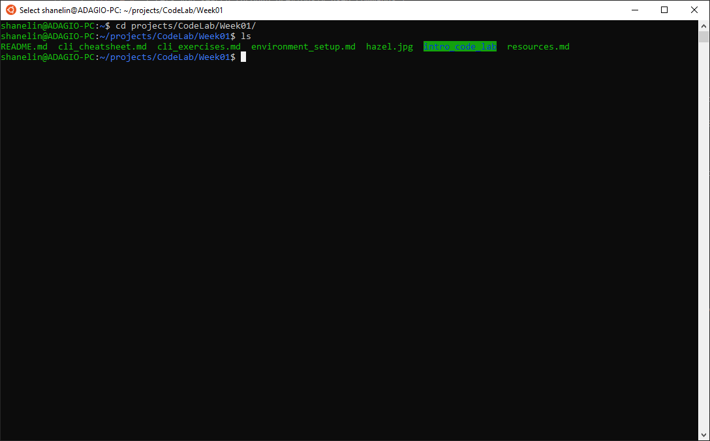

# The Command Line Interface

## Introduction

This will be a quick guide and cheatsheet that you can refer back to for reference. I'll leave the heavy lifting of teaching mostly for the Programming Historian lesson in the homework.

So, okay, this is the command line.

Here's a basic terminal window on one of my machines (running Ubuntu through WSL on a Windows machine). Yours may look different (hopefully it's prettier than the garish colors in this default shell). Before Graphical User Interfaces (GUI) like the one that you're almost certainly reading this on became ubiquitous, Command Line Interfaces (CLI) were how people used computers. So why learn any of this now? GUIs often abstract and simplify, but CLI lets you tell a computer to do exactly what you want it to do. It facilitates an understanding of what's happening "under the hood" (or at least a little bit more under the hood than usual). Finally, the output of our coding efforts and the data that we'll use and produce will mostly be text, which suits CLIs. It's also the most common way to connect to remote computers, for when you want to control a distant web server or virtual cloud host. Finally, CLIs are long-lived. The shell that we're going to teach you to use traces its roots to the 1970s. Whatever new technology is around the corner, it'll still be useful to know how to drive a command line.

In the example above, the "shanelin@ADAGIO-PC" part is my user name and the name of my computer (excuse the tempo joke). This is useful to see because the command line lets us easily switch between users and computers. The parts after the colon ("~" and "~/projects/CodeLab/Week01") are the current working directory path. The $ sign, which might be something else on your terminal, separates the directory path from the command. In this case, I've simply entered `cd projects/CodeLab/Week01` to change directory to the projects/CodeLab/Week01 directory and `ls` to list the contents of that directory. For commands with output (in this case, `ls`), the output appears below the command.

## A few random notes

* You may or may not be able to change where the cursor is by clicking your mouse, which isn't so surprising since they're not supposed to be graphic interfaces.
* Copy and pasting can also be tricky. The usual keyboard shotcuts (ctrl/cmd-C and ctrl/cmd-V) might not work. Try adding a shift to the shortcut. Some terminals also support pasting by right-clicking on the window.
* Depending on circumstance, files and directory names may or may not be case sensitive. Try not to create files or directories that differ in name only in case (i.e. don't make a foo.txt and also a Foo.txt).

## Glossary

| Term              | Description |
| ---               | --- |
| Bash              | "Bourne Again SHell", a common default shell in many Unix-like operating systems |
| CLI               | Command Line Interface, a general term for text input/output interfaces, dating back to the 1950s |
| Console           | Nowadays, synonymous with "Terminal". Long ago, the console was the hardware that ran the terminal software. |
| Delimiter         | A character that separates different blocks of text, e.g. directory names in a path or columns in a CSV. |
| Directory         | Also called a folder, something that holds files and other directories. A file system organizational abstraction. |
| File              | A discrete piece of data, often encountered as a digital photo, video, document, web page, spreadsheet, etc. |
| File System       | The software that controls how files and directories are stored in a computer. Different operating systems. |
| Home              | In a Unix-like system, each user has a home directory intended to store that user's personal files. The home directory is the default working directory and can be accessed with the path shortcut `~` (e.g. `cd ~`). |
| Host              | Another way to say "computer", somewhat complicated by modern computing where hosts can be virtual. |
| Linux             | A family of free, open source Unix-like operating system. Extremely popular in a variety of computing applications (>95% of web servers run some flavor of Linux), but unpopular in personal computers. Ubuntu is one kind ("distribution") of Linux. |
| Operating system  | The fundamental software that runs other software in a computer. Handles common tasks like input/output and system infrastructure like the management of shared resources. MacOS, Windows, and Ubuntu are kinds of operating systems. |
| Path              | A way to address a file or directory in a file system. `/home/shanelin/`,`~`, and `.gitignore` are examples of absolute and relative paths. |
| Prompt            | Also, "Command Prompt". A character that indicates that a CLI is ready to accept input. Commonly includes a `$`,`:`,`#`, or `>` characters, but can be customized. In Unix-like systems, the prompt will often include the username, hostname, and the working directory path. |
| Shell             | Software the implements the CLI. Bash, Zsh, and Powershell are examples. Often used interchangeably with "terminal", which is technically incorrect, but people understand what you mean. Shells receive commands from the terminal. |
| Super User        | In Unix-like systems, an administrative account that has the ultimate, unrestricted permission to change the system. Sometimes named (or merely called) "root" or "admin". |
| Terminal          | Software that hosts shells. Examples are MacOS's Terminal.app, Windows Terminal, the Powershell terminal that runs the Powershell shell. Often used interchangeably with "shell", which is technically incorrect, but people understand what you mean. Terminals send commands to shells. |
| Unix              | Influential operating system from the 1970s, now largely relevant for establishing the conventions and idioms of Unix-like operating systems like Linux and MacOS. |
| Wildcard          | A special character that stands in for any other character (and sometimes characters). Often `?` or `*`. |
| Zsh               | Z shell, a common shell in many Unix-like operating systems, including recent versions of MacOS. |

## Shell/Terminal Shortcuts

Might depend on the terminal or the shell.

| Command | Description |
| ------------- | ------------- |
| `Tab` | Auto-complete files and folder names |
| `Up Arrow`| Scroll through previous commands |
| `Ctrl + A` | Go to the beginning of the line you are currently typing on |
| `Ctrl + E` | Go to the end of the line you are currently typing on |
| `Ctrl + R` | Lets you search through previously used commands |
| `Ctrl + C` | Kill whatever you are running |
| `Ctrl + D` | Exit the current shell |

## Paths

A computer stores files and directories (folders) in a "tree" structure. Under this analogy, directories can contain files and other directories in a branching pattern. Each directory therefore has zero or more "child" directories and always a single "parent" directory, all the way up to the lowest, "root" level.

In the command line, we traverse this structure using the [path](https://en.wikipedia.org/wiki/Path_(computing)). Linux, MacOS, and WSL on Windows use Unix-style path notation, so directories and filenames are separated ("delimited") by a forward slash `/`.

Paths that begin with a forward slash (e.g. `/usr/bin`) are absolute paths, which means that the first element is at the root (lowest level) of the tree.

Paths that begin with a directory of file name (e.g. `README.md`) are relative paths that will depend on the current working directory.

Files that start with "." are often supposed to be hidden files, which just means that they're intended to be kept out of sight.

Special path symbols:

| Symbol | Description |
| ------------- | ------------- |
| `.` | Current folder |
| `..` | One directory level up |
| `~` | home directory |

Any command that takes a filename will also allow you to specify a relative or absolute path to that file, e.g. `touch ../file.txt` or `rm /temp/error.log`.

## SHELL COMMANDS

| Command | Description |
| ------------- | ------------- |
| `pwd` | Print full working path |
| `cd [folder]` | Change into a directory |
| `cd ..` | Change directory upwards |
| `ls` | List contents of a directory |
| `ls -la` | List all contents including hidden files |
| `clear` | Clear the view |
| `open [file]` | Opens a file |
| `open .` | Opens the directory |
| `touch [file name]`| Creates a new file |
| `rm [file name]`| Remove a single file |
| `mkdir [directory name]` | Make a new directory |
| `cp [file] [new file/new directory]` | Copy file to file or new directory |
| `mv [file] [new file/new directory]` | Move file into new file or directory |
| `rmdir [directory]` | Remove directory ( only operates on empty directories ) |
| `rm -rf [directory name]` | Force remove a directory and all its contents | 

## ADVANCED COMMANDS
| Command | Description |
| ------------- | ------------- |
| `sudo [command]` | Run command with the security privileges of the superuser (Super User DO) |
| `cp *.js`| Use wildcards to get all files of a certain type when moving or copying|
| `!!` | Use double bang to repeat last command |
| `nano [file]` | Opens file in Terminal editor |
| `q` | Exit |
