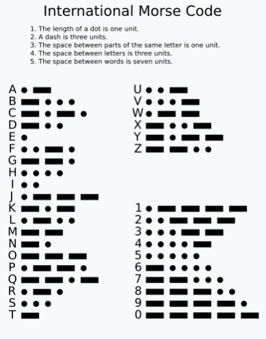
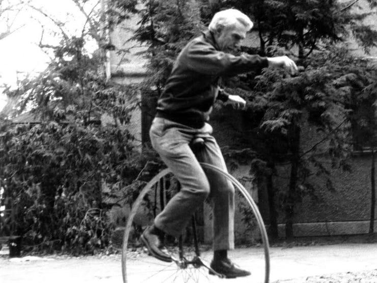
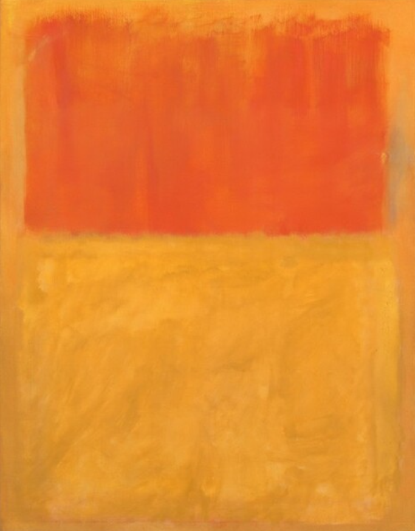
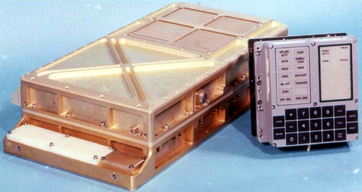

# Introduction to Data

Q: Print it out and delete it? Let's set it aside and revisit it at the end.

## How to data?

Let's start off, like before, not by talking about computers (a subject that I'm relatively well-qualified to talk about) and instead by talking about linguistics (a subject that I'm not at all qualified to talk about).

**What is this?**

`It's a photo of Rocky, a dog, specifically an Australian Cattledog/red heeler, lounging on a blue fuzzy bed that he likes, a model recommended by Amanda. He's a very silly boy.`

This is a description which relies on a mapping of abstract concepts to symbols. The words "Australia" and "recommended" and "silly" convey meaning through our knowledge and our experience of the world. We're constantly "translating" symbols of different languages. There's a theory in the philosophy of the mind that there's a Language of Thought, that when we think in our brains we're using a cognitive language that we translate imperfectly into natural language when we speak. When we write down that speech, we translate the phonemes of our spoken language into written ones. Oftentimes, the translation isn't so consistent or unambiguous: the understanding of concepts like "recommend" or "silly" or even "Australia" differ dramatically from person to person, day to day, context to context.

When we translate or convert symbols from one language or representation to another and there's a precise and consistent and unambiguous mapping of all the symbols, we call that _encoding_ and the system of rules to enact that translation a _code_.

Morse Code is a well-known example of a code that encodes the latin alphabet, arabic numerals, and a few punctuation marks into a system of dots and dashes, signals that differ in duration. Well, this is not entirely true. If it was just dots and dashes, it would be a binary code, but it's not.

**What can we make out about Morse code?**

In Morse code we have an unambiguous and consistent mapping of letters into dots and dashes (and pauses). The particular format of using dots and dashes form, effectively, two different "letters" that have to be combined to form each of the symbols the encoding supports. 

There is no casing in Morse code. Upper and lower case letters are the same. There are various international adaptations of Morse code that add accented letters and non-Latin alphabets, but the standard Morse code is not capable of conveying Cyrillic or Greek alphabets or non-alphabetical scripts without Romanization or an intermediate mapping layer.

For efficiency, the most often-used letters are shorter. This reduces the overall length of the message and improved the speed that operators could send them. A bit of trivia: operators vocalizing the Morse code spoke dot and dash as "dit" and "dah", and this was then sometimes facetiously corrupted as "iddy" and "umpty". Perhaps related to the verbosity of numerals, this eventually led to the word "umpteen".

Morse code could also be used in ways that didn't translate directly to English but still used English characters. Althought this table doesn't show it, we also had the historical practice of telegraph operators inventing shorthand code "words" to convey specific, more complex messages, the precursors of LMAO and ICYMI: BYOXO was "Are you trying to weasel out of our deal?"; BMULD was "You're a skunk!". On top of Morse code, a variety of other codes designed to facilitate specific domain languages flourished in the late 19th-early 20th century.

Let's get closer to talking about actual digital stuff. This is a good time to about Claude Shannon.

## Claude Shannon

Shannon was an American electrical engineer and mathematician known for his foundational work on information theory and digital circuits, and for his enthusiasm for mathematical puzzles, juggling, unicycles, and computer chess. He created a machine (with his student, the AI pioneer Marvin Minsky) whose only function was to turn itself off.

In 1937, at the age of 22, he wrote a master’s thesis that established the fundamental principles of digital circuit design from which all modern computers were created. At 32, he published the landmark paper, *A Mathematical Theory of Communication* which founded the field of information theory. It's this paper that we're mostly interested in.

I think it's actually kind of funny, teaching Shannon and information theory in an introduction digital humanities tech course. There's a good deal of text analysis in DH, but Shannon worked out the fundamental ideas about information from the opposite direction.

After he got his doctorate, Shannon went to work at Bell Labs, where he worked on secure communications during World War II (when Alan Turing, working on breaking codes instead of making them, visited Bell in 1942, the two met for tea daily). One major problem with scrambling messages so that they can't be read is that messages written in human languages tended to be really predictable. At a basic level, there is an enormously uneven distribution of letters in English (as one example). At a higher level, some sequences of letters appear frequently while others never appear in any word and there are many more possible combinations of five letters than there are five-letter words. Predictability opened up weaknesses that codebreakers could exploit. In fact, Turing's work breaking the German Enigma cipher often relied on the frequency of common messages like "nothing to report".

In *A Mathematical Theory of Communication*, Shannon considered the meaning of this sort of uneven distribution. Let's say that we're playing a few rounds of the word game Hangman, but I take pity on how poorly you're doing and tell you one the first letter of a word right off the bat. **Do I give away more or less information if I tell you that the word starts with "S" or with "Q"?**

Shannon recognized that what the amount of information conveyed could be understood as entropy, essentially the degree to which you are surprised at learning something. If I tell you that the word starts with S, that fact tells you less than if I told you that the word starts with Q because many more words start with S than start with Q. In the same sense, telling you a losing lottery number conveys less information than telling you a winning lottery number. As we've seen, in communication, we often intuitively reduce the length of text by swapping out common letter combinations, phonemes, and phrases with shorter replacements: BMULD, LMAO, Ph.D., SLab, et al. Mechanically, we can reduce the size of lower entropy files like English text by compressing them.

Shannon suggested that we could exactly quantify this degree of entropy to measure the information content. Consider a coin that has an equal chance of flipping heads or tails. Flipping that coin selects between two equally possible outcomes, producing an entropy of one "bit", a portmanteau of "Binary Digit".

Hang on to that for a second.

A year after Shannon published *A Mathematical Theory of Communication*, he published an expanded version of the paper. In recognition that the ideas it contained were more universal and more fundamental than he had realized, Shannon titled this new version, *The Mathematical Theory of Communication*.

All of this is useful to keep in your short term memory as we transition to actually talking about data in a more digital context.

## Digital

So we've been dancing around this term, Digital Humanities. **But what exactly is "digital"? What is "analog"?**

Digital is, as the name suggests, something that has to do with numbers can count. Analog is "analogous" to reality. So what does this mean?

**A short exercise**: how do we, as people, count?

When we count: one, two, three, etc, we are listing a set of discrete symbols. That's "discrete", meaning "distinct and separate" rather than "discreet", meaning "circumspect". So, these counting numbers are whole numbers, positive and negative, and zero; these are called integers.

What's excluded from this set? For one, non-whole numbers, what mathematicians call "real numbers" that can have infinitesimally small differences between them. Think of it this way: there's no integer that sits between two and three, but there is an infinite number of real numbers between two and three.

We go to the East Building of the National Gallery of Art and look at this painting by Mark Rothko, _Orange and Tan_. What do we see? We stand closer and closer. We make the docent nervous. We lean forward, almost touching the paint with our foreheads. The docent starts to signal frantically to a guard. What do we see?

From far away, we see the paint. From close in, we see the paint, bigger, and the paint between the paint. It's all paint. It's hues that shift continuously from one to the next, as colors mix into each other. When we zoom into this digital photograph of Rothko's _Orange and Tan_, what do we see?

When we visualize music performed by an physical instrument, it's as a continuous waveform. It's smooth and if we look closer and closer, we don't see any gaps. When we visualize a digital Spotify stream, it's a series of jagged stairs that aproximate the waveform. It's full of discontinuities. In the registers at the very edges of human hearing, the stream is designed to be more jagged.

It turns out, computers don't really do "infinite". Remember the Babbage's Difference Engine: there's only so many gears with so many teeth. You can add more, but you can't add infinitely more. Digital computers are also machines that exist in reality and while we build them at a very small scale, we can't build infinitely small. So we get "digital" as a kind of compromise: these nice round numbers that don't exist in nature that we can use to aproximate the complexity of reality.

There is what is probably best termed a _speculation_ in physics called "digital physics", which imagines that the universe is, at some level, a discrete, _countably_ measurable thing, that we get to a certain point and things stop getting smaller and become perfectly knowable. One implication of this idea is that the universe is functionally a digital computer itself. Digital physics is not a serious part of our current Physics, but the kind of understanding of the universe it implies is so abstractly distant that that might not actually be such a hurdle.

## What is a (digital) computer?

Let's talk about what a computer is again, but this time let's not be cute about baboon bones. A computer is a box full of electricity that plays TikTok (Note: update cultural reference every 5 Praxis cohorts). It's a very complicated box, but when we zoom all the way in, the really important stuff is made up of transistors. A transistor is basically an electrical valve: if you switch it on, it allows electricity to flow through; switch it off and it doesn't. The trick is that the valve is controlled electrically also, so you arrange all the transistors in this complicated way where they're controlling each other and voila: TikTok.

As a rule of thumb, the more transistors (and the higher density of transistors), the more powerful the computer. We've gotten really good at making transistors really small. In the late 1960s, the Apollo Guidance Computer that navigated spaceships to the moon, a marvel of miniaturization, and back had around 10,000 transistors in it.

A decade later, this was roughly how much the first popular personal computers (the Apple II, the Radio Shack TRS-80) had. The main Apple M1 chip in my laptop, a model from a few years ago, has 16 billion transistors and a whole lot more when you consider the rest of the machine: the chips to control all the subsidiary functions of the laptop, and the chips to contain the memory and storage.

Remember that a transistor is a valve with two settings: on and off, which we can also represent as True and False and as ones and zeros. So it has two states, kinda-sorta like Morse code. As a consequence of transistors being the most fundamental building block of computing, the fundamental "cognitive" abstraction of our computers, how they process and store information, is binary. Trivia: the On/Off power switch symbol is an ISO standard symbol comprising a one and a zero.

# Binary data

Morse code encoded decimal numerals, it translated the dots and dashes into decimal numerical symbols. With binary actually being represented as ones and zeros, we can directly understand binary data *as* numbers.

**A short exercise**: Seriously, how do we count?

As modern humans we typically use decimal numbers. _Deci_, meaning ten. I assume. We call it this because it uses _base ten_ position notation. There are ten numerals, zero to nine. When we count, we start at zero and advance through all of the numbers until we get to nine. After nine, we're out of numbers, so we reset back to zero and advance the next highest position by one. So, nine (or we can think of it as `09`) advances to ten (`10`).

Thinking about how we use decimal numbers is useful to understanding how we use binary ones. Using these rules, **how do we count in binary?**

Because of binary, a lot of "computer numbers" tend to be powers of two. When you buy a new iphone, they come in 128gb (27), 256gb (28), and 512gb (29) models. As you work with computers, these powers of two will show up everywhere. You'll become very familiar with 2, 4, 8, 16, 32, 64, 128, and 256.

Let's take a closer look at the decimal system. Every position is a power of ten: 10 = 101, 100 = 102, 1000 = 103, etc. Each additional decimal position adds 10 times as many possible values: 1 digit has 101 possibilities (0-9), 2 digits has 102 (0-99), etc. In binary, each position adds twice as many possible values.

Remember Shannon and his bits? One bit is one binary position. 1 binary digits has 21 = 2 different possible values (0-1), 2 has 22 = 4 (00, 01, 10, and 11), 3 has 23 (000, 001, 010, 011, 100, 101, 110, 111), and so on.

## Boolean

There's an even simpler kind of data to represent using binary numbers than whole numbers: booleans. Named for mathematician George Boole, who did some early work on this, Boolean data is just True and False. We represent True as one and False as zero. Booleans are useful for computer scientists and electrical engineers to know because they directly mirror the states of transistors and, even as digital humanists, we can use boolean logic to do a lot of useful programmy stuff. But that's really for another week (or another semester).

## Text

These number systems are just different representations of the same numerical ideas. Other forms of data can be encoded using numbers. Under the hood, each character in text data is represented on a character encoding table that map numbers to letters. An important and influential encoding scheme is ASCII: the American Standard Code for Information Interchange, formalized in 1968. ASCII maps Latin letters and Arabic numerals, as well as common punctuation symbols, to a set of 128 numbers. 128 is 2^7, so these numbers can be represented by a total of 7 bits. 

Since the 1960s, software developers have created a plethora of character encodings, often to represent characters from other languages. Although you might occasionally run into these in older datasets, the singular modern text standard is called Unicode (well, sort of singular, since it's a family of encodings), which strives express the complete canon of human language. The current specification, Unicode 13, encompasses 143000 characters, including emoji and archaic scripts. The first 128 characters of Unicode are identical to ASCII, which helps maintain backwards compatibility with older Latin text data.

Under Unicode (UTF-8, specifically), a Latin alphabet character takes 8 bits to store.

## Colors

Computers express color using a series of numbers representing the mixture of additive or subtractive colors. For digital displays, the RGB system is the most common. This comprises a set of three numbers representing the amount of red, green, and blue light ("channels"). Early color computer displays used a single bit (on/off) to represent each color, but the most common standard is 8 bits per channel (0-255) for a total of 24 bits (or 16 million total color combinations). 

Colors are most often shown as hexadecimal numbers (base 16). Hexadecimal uses 0 to 9 and then A to F. Since each hex digit is equivalent to 4 binary digits, each 8-bit color channel can be represented by 2 hex digits. If we look at the [Scholars' Lab website](https://scholarslab.org/) and dig through the stylesheet, we will see that the background color is defined as `000000`, a set of three hexadecimal numbers indicating that each color should be 00 out of FF in hex, which is also 0 out of 255 in decimal. This is the blackest black. Links are underlined with the color `75e3f0`, which is a little red and a lot of green and blue resulting in a cyan color.

## Also: Bytes!
Byte is another common unit of measurement for data. The term is a play on bit and was coined in the 1950s for Project SAGE, a prototype computer system to coordinate American air defenses in the Cold War. There is some historical ambiguity, but a modern byte is 8 bits, representing the smallest power-of-2 size for useful data (such as a single character or a small integer). Bytes and bits are often modified with metric scale prefixes: kilobyte, megabit, gigabyte etc. This is a bit of a mess because it mixes binary units with decimal prefixes, but that's how we get our current popular units for data size.
