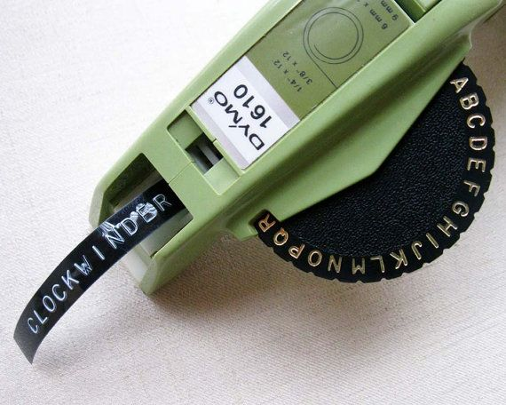

# Introduction to Python


## Before we get started...
Computer programs are algorithms. These two things are so connected in the lay imagination that they are sometimes used as synonyms for each other. The media talks about "The Algorithm" when it describes Google's search and ad services, Netflix's recommendations, or TikTok's infinite video scroll, but an algorithm isn't some sort of magic tech thing. It's just a sequence of unambiguous procedures, like a particularly rigorous recipe. A computer program is an algorithm that's formatted in a language that a computer can understand.

But knowing the language is only part of writing code. We have to know *what* to tell a computer as well as *how*.

One of the best ways to figure out the *what* is to think about how we might solve the same problem as humans. It's useful to break up things we intuitively conglomerate in our heads into discrete steps. We don't usually examine what we're actually doing when we make exact change or sort of deck of playing cards, so it's useful to make the effort to describe each step, algorithmically. After that, it's just a matter of translating our algorithm into computer language.

This kind of process often helps us define the problem more concretely (what do we mean when we say "sort" a deck of cards?), identify ambiguity in our procedure, and discover unexpected "edge cases" that fall outside of our normal use.

## Python interpreter as calculator
Let's get started with Python.

Python comes with an interactive interpreter that executes your instructions as you enter them line by line. For beginners, it's an excellent way to sandbox your ideas or check your syntax. Start the interactive interpret using the `python` (or `python3`) command.

One of the simplest things we can do is basic arithmetic:

```python
1+1
2**3
```

You can exit using `exit()`. The interactive interpreter is useful to test out an idea or to double check syntax or whether the output of a function matches expectation. But what we type into the interactive interpreter isn't saved and we have to feed it line by line, so it's not a good way to actually write a computer program. For that, we can use VS Code.

## Saving and running Python files

To write and save a Python program, the typical convention is to use the `.py` extension. When we save a file as a .py file in VS Code, it also tells VS Code that it contains Python code and will automatically activate code highlighting and syntax checking.

To run a Python program that you've saved, we can use the `python` command through the terminal with the name of the file that contains your program (if running `python --version` in the terminal shows a 2.x version or "command not found", you will need to use `python3` instead):

```
python code.py
```

## A quick note about Python 2 and Python 3
The Python programming language was first conceived in the late 1980s, but became popular after the release of Python 2.0 in 2000 (not to be confused with [Pythons 2](https://www.imdb.com/title/tt0330795/?ref_=nv_sr_3)) when the language switched to a more public code repository and a more open, community-driven development model.

Python 3 is the current major version. It was released in 2008 as a major reformation of the language that made it more consistent and unified redundant mechanisms. Python 3 is not backwards compatible with Python 2; it is, in effect, a new language. You should definitely use Python 3 because Python 2 finally went away (as coders say, became "deprecated") after more than a decade of parallel adoption.

Many computers come with Python already installed by default. Depending on how yours is set up, running `python` may run the Python 2 or Python 3 interpreter. To determine which one, run the command `python --version`. Pipenv should have this all sorted out, but more on this later.

## Hello World

Let's take a look at the traditional program used as an introduction to countless programming students before you, Hello World:

```python
print("Hello World!")
```

Try saving this code as a program and running it.

"Print" is a function, which is like a command. Functions are called by writing the function name followed by parenthesis. Inside the parenthesis are zero or more parameters, which are extra bits of information that you attach to the function. The "print" function simply writes out the data that's passed to it.

## Variables



One of the most fundamental parts of coding is to remember things, which is say: to name them so we can keep track of them. When we describe, in our algorithm exercises, writing the results of a math function down, tallying a count, or even pointing with our finger to a particular item in a list, this is what we're doing. In programming, the label that that put on a piece of data is called a **variable**.

When we name a variable and associate it with a piece of information, that's called variable assignment and we do it like this:

```python
a = 3
b = 4
print(a+b)
```

Note the direction of assignment here. In this example, the variable names "a" and "b" are assigned integers 3 and 4 (an integer is a whole number and also a type of data which represent whole numbers).

Variable names have to start with a letter or an underscore and can only contain letters, numbers, and the underscore character. No spaces. They're also case-sensitive, so `SLAB` `slab` and `SLab` are different. Certain words are reserved by the language and cannot be used as variables. There are some more conventions about what kinds of names should be used for variables, but they'll only be useful once we understand a bit more about how they work.


## Classes, Objects, and Instances

 Objects,If variables are labels, then what is it that they reference? Let's use, in Scholars' Lab custom, a dog metaphor. When we see the word "dog", we understand that word on a variety of levels.

1. In a very high level sense, there's the abstract notion of "dog", which describes the behaviors and qualities shared by all dogs (e.g. "bark", "endothermic metabolism"). "There is a whole chapter about dogs in this biology textbook."
2. Then there's the actual, physical population of all dogs or some anonymous subset of that population. "Dogs are the most popular pet in the world" or "let's go adopt some dogs from the shelter."
3. Finally, there's the specific, singular individual dog that we can point to. "Rocky is a surpassingly fine dog."

In a programming language, these catagories are useful to illustrate the relationship of classes, objects, and instances

1. The abstract idea of a thing can be described as a "class" or "type" (we can use these more or less interchangeably).
2. The anonymous, but concrete idea of a thing is described as an "object".
3. The exact individual dog is an "instance" of a dog. 

This will be clearer once we start to put these terms into practice. Let's take a look back at the last bit of code.

```python
a = 3
b = 4
print(a+b)
```

Knowing that 3 and 4 are Integers, we can now say that what are doing on the first two lines is assigning instances of the Integer class to two variables, A and B. Print is a function that expects an object as a parameter (`print()` is pretty voracious, so many different classes are acceptable) and the integer that results from `a+b` is an object.

Another thing to note here is that although we print `a+b`, we haven't bothered to assign it to a variable. It's an instance that's just floating out there, without a label. This means that we can't refer back to it later to use it for something else. We'll have to perform the addition function again rather than just being able to remember what it was.

### Numbers

So far, using variables in code looks very much like using them in a math equation. Here, we assign names to represent particular pieces of data which may change, often inputs and outputs, and then we use them just like we would in a formula like `a^2 + b^2 = c^2` to find the hypotenuse of a right triangle. In Python, we need to do a little bit of housekeeping to solve for square roots (we'll talk about the `import` line and the bit about `math.sqrt` later). For now, we can see how the variables `a`, `b`, and `c` work. Also note that, in Python, `a**2` means to raise `a` to the second power.

```python
import math
a = 3
b = 4
c = math.sqrt(a**2 + b**2)
print(c)
```

`3` and `4` are integers. But this code prints out `5.0` instead of just `5`. This is because the square root function results in a "floating point number" (sometimes just "float") instead of an integer. This is a kind of data that's used to represent real numbers like 1.4142 or 3.14159. In Python, they have limited precision and have some additional quirks due to their underlying binary representation. For our purposes, this is more of an occasional curiosity rather than a serious problem. If you're coding, say, [post office accounting software](https://en.wikipedia.org/wiki/British_Post_Office_scandal), you should probably read up on them more closely.

### Aside: sometimes floats are weird

What does this code result in?

```python
0.1+0.2
```

Huh, weird.


(No one really understands binary because no one thinks in binary)

Let's remember that all data in a computer is represented as binary (base 2) numbers, comprising only 1s and 0s. The text you're reading now is represented by individual characters that, under the hood, are stored as binary numbers. The method of translating these information between different forms and contexts (such as between binary numbers and text or numbers) is called encoding.

Integers are easy enough to represent in binary: 0 is 0, 1 is 1, 2 is 10, 3 is 11, 4 is 100, and so on.

But floats are trickier and require a special system to represent. Don't worry about it for now, but consider for a moment that it's impossible to represent exactly 1/3 in finite decimal notation (0.3333...). It's similarly impossible to represent some simple decimal numbers in a binary notation. Which is why you get the weird results above.

[Float to Binary Converter](https://www.h-schmidt.net/FloatConverter/IEEE754.html)

[IEEE 754 Standard](https://en.wikipedia.org/wiki/IEEE_754-1985) if you really want to learn more. You probably do not want to read this.

### Strings

!["I, for one, welcome our new [string] overlords"](assets/overlords.jpg)

Variables can represent different types of data. So far, we've used them for different kinds of numbers, but of course there's also text. In code, we call a sequence of characters "strings," which is a nod to typesetting lingo.

```python
noun="Scholars' Lab"
print("I, for one, 'welcome' our new "+noun+" overlords!")
```

In the second line here, we use the + operator to concatenate (add together) three strings together and pass the result to print.

You can also "multiply" strings.

```python
print("Scholars' L"+"a"*10+"b")
```

### Booleans
```python
print(True)
print(False)
print(True or False)
print(True and False)
print(not True)
```
True in Python is interchangeable with the number 1 and False with 0.

## Comments and Documentation
### Inline Commenting
```python
# Help I'm stuck in a Python interpreter
1+2+3
```

Comments are especially useful--necessary!--for collaboration. Python is open source and its community of millions of coders often share in its permissive approach to intellectual property. Python as a whole is a giant collaborative project of which you are now members.

When you write particularly complicated logic or whenever you write new classes or functions (more on this later!), you should write a comment to explain yourself. I will be using comments extensively in the lesson documents to explain what's going on in code.

### Documentation

Python, as with virtually all other languages and complex codes, contains extensive documentation that covers all aspects of its use. This documentation is [easily accessible via the Internet](assets/MissionImpossible.m4v?raw=true).

[Python 3 Documentation](https://docs.python.org/3/)

Let's take a look at the specific documentation for strings:

[Python 3 Docs: Built-in Types: Strings](https://docs.python.org/3/library/stdtypes.html#string-methods)

Learning to read documentation is a critical skill for succeeding as a programmer. Happily, most of you, as graduate students, should already be literate.

## Interlude: The Zen of Python
### What's the deal with Python? 
Type this into Python:
```python
import this
```

Here's [one interpretation of Z of P](https://inventwithpython.com/blog/2018/08/17/the-zen-of-python-explained/).

Also, a DH answer: lots of DH projects are written in Python because of its simplicity and robust community and its popularity in areas like text analysis and machine learning.

## Saving and running code
The Python interactive interpreter is very useful for experimentation, but if you want to write something less ephemereal, you'll want to save it as a file so that it can be run over again without going through it line by line. The code is exactly the same, just save it as a text file to your disk with the usual Python file format extension, .py.

Now, you can run the resulting file using the command `python code.py` (or `python3 code.py`).

There are some important differences in behavior between running code through the interactive interpreter and as a saved .py file. The way that we've been using the interpreter so far has relied on how it returning values that we reference.

If we run these two lines in the interactive interpreter, we see that the second statement prints 2 because Python assumes that we want to know more about it:

```
>>> a = 1+1
>>> a
2
```

If we ran these lines from a .py file, nothing will print at all because the statement `a` on the second line doesn't actually tell Python to do anything. In a .py file, we have to explicitly tell Python to print using the print() function.

```python
a = 1+1
a
```

## Input
Code that always does the same thing is a little boring. Let's spice up the earlier example a bit with user input.
```python
madlibs=input("What manner of overlords do you, for one, welcome? ")
print("I, for one, welcome our new "+madlibs+" overlords!")
```

We can see here that `input` is a function, just like `print`. `input` asks the user to type something and then it "returns" that something back to Python. We'll be writing our own functions soon enough. For now, it's important mainly to understand that functions can hand back bits of data and, like mathematical functions, we can treat the function and the result interchangably in our code. So, if we were to run the example above and the user types in "Hazel", the string "Hazel" would be saved into the variable `madlibs` just as if we'd coded `madlibs="Hazel"`.

## Sequences
### Lists


Lists are one of the most common and useful types in Python. It is a kind of ordered collection, neaning that it contains other objects and those objects are arranged in a sequence. Lists in Python are defined using square brakets, like so:

```python
l = ["Brandon","Ronda","Jeremy","Shane"]`
```

We can refer to an object in a list (an "element") using its position within the list, called its "index". Python list indices, like many other things in computing, are zero-indexed, meaning that we start counting at zero. To retrieve the first element (the element at index 0) in the list we just defined, we can use this code:

```python
print(l[0])
```

Lists can contain any other type of object, including other lists (so you can have lists of lists, which are very useful for things like coordinates). You can play with these examples in the Python interpreter to try out different list actions:

```python
# Defining a list that we assign to the variable `dogs`
dogs = ["Toby","Bofur","Hazel","Rocky","Maple","Henry","Fat Dog","Monty","Keefa","Triscuit"]
# print the first element in `dogs` (remember: zero-indexing)
print(dogs[0])
# print the last element in `dogs`
print(dogs[-1])
# print the sub-list consisting of the fourth element in `dogs` to the end
print(dogs[3:])
# print the length of the `dogs` list
print(len(dogs))
# sort the dogs list, then print it
dogs.sort()
print(dogs)
# sort the dogs list in reverse, then print it
dogs.sort(reverse=True)
print(dogs)
```

[Python 3 Docs: Built-in Types: Sequence Types](https://docs.python.org/3/library/stdtypes.html#sequence-types-list-tuple-range)

Strings are actually sequence types, just like lists! They're sequences of characters and we can address particular characters just like with lists.

```python
gooddog = "Rocky is a good dog"
print("Every dog"+gooddog[5:])
```

## Modules
### Python Standard Library
```python
import random
print(random.randint(0,10))
```

[Python 3 Docs: Standard Library: Numeric and Mathematical: Random](https://docs.python.org/3/library/random.html#module-random)

Of course, you don't always want to write your own code. Programmers are ~~lazy~~ efficient. Python has a famously robust built-in Standard Library so you can reuse the work of thousands of programmers who have contributed to it. This Standard Library is part of the language itself and is included in every Python installation.

For more specialized tasks, it's also easy to use the work of third party developers. But we'll leave that to another week.

