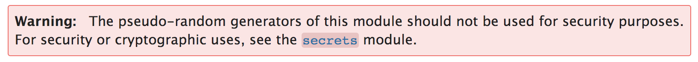

# Classes

Okay, let's talk classes!

Say we have this function:

```python
def whos_a_good_dog():
    return("Hazel")
print(whos_a_good_dog())
```


This is very simple. Let's make it a bit more complicated. `return` only takes one object, so if we want to return multiple dogs, we can return a list of strings (a list is one object, which contains multiple elements within):

```python
def whos_a_good_dog():
    return(["Hazel","Maple","Bofur","Toby"])
print(whos_a_good_dog())
```

This is pretty legible because these are all the same type of things. But what if we want to return more than just the dog's name? Does "Hazel" really capture the full goodness of this dog? Of course not.

What if we want to return other attributes about Hazel? She's some sort of Beagle mix. She's Shane's dog. She likes treats, naps, and raccoons; she doesn't like thunder. How would we have this function return all of this information?

We've experimented already with using data structures to describe, er, data in a more *ahem* structured way. We can return all of this data using lists and dictionaries:

```python
def whos_a_good_dog():
    return({"name":"Hazel","breed":"heeler/beagle","owner":"Shane","likes":["treats","naps","raccoons"],"dislikes":["thunder"]})
print(whos_a_good_dog())
```

This isn't too bad, but we can do better. It's a perfectly fine way to describe complex data within a single object, but if we add more dogs, we'd want to add logic to ensure that they have the same keys and maybe to compare likes and dislikes. Where would that logic go?

On top of that problem, a dog isn't just data. I think this is one of the Four Noble Truths.

Here, we've described largely static information about Hazel. But a dog has behaviors and feelings. In code-speak, we can say that it has logic and states.

A class is really useful to encapsulate both data and functions in a single cohesive unit.

A class is a particular type of objects. We can create ("instantiate") an object of a class and store it as a variable. A variable therefore contains (technically, contains a reference to) an *instance* of a class.

We've already used a lot of built-in classes. Strings, lists, dictionaries are all classes. We can have Python tell us what kind of class it is using the built-in function `type()` (terminologically, "type" is often used interchangably with "class", though there are subtle differences depending on the particular language).

```
>>> a = [1,2,3]
>>> type(a)
<class 'list'>
>>> b = "123"
>>> type(b)
<class 'str'>
```

We can define our own classes too. Let's make a simple dog class with a "speak" method.

```python
class Dog:
    name = ""
    def speak(self):
        print("Bork bork! My name is ",self.name,"!")

maple = Dog()
maple.name = "Maple"
maple.speak()

hazel = Dog()
hazel.name = "Hazel"
hazel.speak()

print(hazel == maple)
```

So, here we define a Dog class, then instantiate two Dogs using `Dog()`. We store those to `maple` and `hazel`. Each of the Dogs are distinct Dog instances and have their own independent data. Whenever we call a class method, we actually implicitly pass in the object itself. That's why the method definitions have `self` in the arguments list. In methods, we refer to `self` when we want to access the variables that belong to the class rather than the method. If you're curious about why we use `self`, [the Python documentation on class scope](https://docs.python.org/3/tutorial/classes.html#python-scopes-and-namespaces) is useful, but you can get by for now just using `self` whenever you want to refer to any class data.

We can see that instantiation is done with a function: `Dog()`. Instead of setting the data for each bit by bit, we can create a *constructor* method that takes in parameters and then handles them. We can do this by defining a special method `__init__` (with two underscores on either side).

```python
class Dog:
    def __init__(self, name, owner, breed, likes, dislikes):
        self.name = name
        self.owner = owner
        self.breed = breed
        self.likes = likes
        self.dislikes = dislikes
    
    def speak(self):
        print("Bork bork! I'm",self.name,"! I like",self.likes[0], "and dislike ",self.dislikes[0],"!")

hazel = Dog("Hazel","Shane","beagle",["treats","naps","raccoons"],["thunder"])
hazel.speak()

```

Classes can be as simple or complex as you want.

Let's try to model a dog class that includes some simple logic to track mood.

```python
class Dog:

    def __init__(self, name, owner, breed, likes, dislikes):
        self.name = name
        self.owner = owner
        self.breed = breed
        self.likes = likes
        self.dislikes = dislikes
        
        # default mood value, range 0-5
        self.mood = 2

    def speak(self):
        if self.mood > 3:
            print("*bork bork!*")
        elif self.mood > 1:
            print("*bark*")
        else:
            print("*grrrrr!*") 
    
    def pet(self):
        self.mood += 1

hazel = Dog("Hazel","Shane","beagle",["treats","naps","raccoons"],["thunder"])
hazel.speak()
hazel.pet()
hazel.pet()
hazel.speak()
```

When we call the constructor (`hazel = Dog("Hazel","Beagle","Shane",["treats","naps","raccoons"],["thunder"])`), we create a new dog object with the parameters we pass in and have the variable `hazel` point to it. We say that the object we created is an *instance* of the class Dog. The variable `hazel` is a *reference* to that instance. Two different variables can point to the same object. Two different objects that contain identical data are not the same.

For example:

```python
hazel = Dog("Hazel","Shane","beagle",["treats","naps","raccoons"],["thunder"])
hazel_clone = Dog("Hazel","Beagle","Shane",["treats","naps","raccoons"],["thunder"])

print(hazel is hazel_clone)

hazel_clone = hazel
print(hazel is hazel_clone)
```

The `is` operator returns True if the object is literally the same (that is, they have the same memory address) and false if they aren't. If we don't do anything special, printing an object will actually print its type and memory address. In this example, we see that even though `hazel` and `hazel_clone` are dogs comprising the same data, they aren't the same *object*. If we use assignment (`=`) to assign the object referenced by `hazel` to `hazel_clone`, we're explicitly telling `hazel_clone` to point to the same object as `hazel` (in some other languages, references are called "pointers") and so they become the same.

(The reason that we're using `is` instead of `==` is because the equality operator can be *overriden* under the hood if we wanted to have some fancy kind of comparison logic. By default, it is the same as `is`, but it's often overriden. We can compare two distinct, but identical lists using `==` and it will return `True` because `list` overrides the equality operator. But that isn't something we need to get into here.)

Classes underpine an influential way of organizing computer programs: Object Oriented Programming (OOP), where the basic unit of code are class. Python was created originally as a primarily Object Oriented language, because Object Orientation was ascendant in the 1990s when Python was first created. Many important programming languages of that broad era are OO languages: C++, C#, Java, Javascript, and Ruby to name a few of the most famous. However, Object Orientation is not the only "programming paradigm" and Python code can be both procedural and functional (more on those in the future... maybe).

It's not necessary or useful to organize our code into classes, especially if that code is fairly simple. However, it is a useful option and important to understand for another reason: we use classes even when we're not defining them. The class is the primary way that Python organizes its own standard library and the wider ecosystem of external libraries.


# A Little Help From Our Friends (at Python)


## Coding is hard

Okay, so we've been coding for a while now. You have the basic tools to take on almost anything!

So, let's flex those muscles a bit. Write me the code to return all the permutations for two items out of a list. This might be useful to pick out all the possible pairings out of a list of Scholars' Lab pets. So we want to go from `pets = ["Bofur","Catsby","Hazel","Maple","Pepper"]` to:

```python
[('Bofur', 'Catsby'), ('Bofur', 'Hazel'), ('Bofur', 'Maple'), ('Bofur', 'Pepper'), ('Catsby', 'Bofur'), ('Catsby', 'Hazel'), ('Catsby', 'Maple'), ('Catsby', 'Pepper'), ('Hazel', 'Bofur'), ('Hazel', 'Catsby'), ('Hazel', 'Maple'), ('Hazel', 'Pepper'), ('Maple', 'Bofur'), ('Maple', 'Catsby'), ('Maple', 'Hazel'), ('Maple', 'Pepper'), ('Pepper', 'Bofur'), ('Pepper', 'Catsby'), ('Pepper', 'Hazel'), ('Pepper', 'Maple')]
```

So, where would we start?

Let's go with one loop on the outside and one on the inside, but we want to make sure that the pet in the outside isn't the same as the one on the outside...

```python
def permutations(pets):
    perms = []
    for pet1 in pets:
        for pet2 in pets:
            if pet1==pet2:
                continue
            perms.append((pet1,pet2))
    return perms

pets = ["Bofur","Catsby","Hazel","Maple","Pepper"]
print(permutations(pets))
```

Easy enough... so far. What if we want to do groups of three instead of two?

```python
def permutations(pets):
    perms = []
    for pet1 in pets:
        for pet2 in pets:
            if pet1==pet2:
                continue
            for pet3 in pets:
                p = (pet1,pet2)
                if pet3 not in p:
                    p = p+(pet3,)
                    perms.append(p)
    return perms

pets = ["Bofur","Catsby","Hazel","Maple","Pepper"]
print(permutations(pets))
```

Whew! This is getting a bit rough.

Okay, so what about permutations of 4 pets? Or a generalizable algorithm that calculates different sizes of permutation sets based on a parameter? Hmmm. I think we're going to have to talk about recursion...

But, wait. Remember when I said (a long time ago) that really novel problems are rare and that it's almost certain that other people have had the same problems as you in the past?

What if we could let some hardworking Python developers do the hard work for us?

## Imports

```python
from itertools import permutations
pets = ["Bofur","Catsby","Hazel","Maple","Pepper"]
print(list(permutations(pets,3)))
```

Easy!

We can see in that first line, `from itertools import permutations`, that we're importing a function, `permutations` from the *module* `itertools`, a set of code that provides tools for iterative computation. [Here's the doc.](https://docs.python.org/3/library/itertools.html) 

Itertools is one of many modules that come as part of the Python Standard Library. When Python was released, it was known for this robust library that provided many common and fundamental tools.

Let's take a look at another example.

How do we write a function to return a random number? Beats the hell out of me. This is... actually a really hard problem that has important ramifications for, among a lot of tother things, security if not done right. So we can just use the Python implementation like we did before. (The Python random function is actually also probably not good enough for high-level infosec uses, but it's sufficient for most things we're liable to do.)



By nature, randomness is complicated and random number generators are too. There's a lot of stuff in the [Python random module](https://docs.python.org/3/library/random.html), but there's also a few easy functions for us to easily get what we want if we don't care about the nuts and bolts.

We can get a random integer (or a random index for a list):

```python
import random
praxis = ["Bofur","Catsby","Hazel","Maple","Pepper"]
print(praxis[random.randint(0,len(praxis)-1)])
```

(I ran this code to test it and I got 4 Bofurs out of 5 tries.)


If we read the doc, we can see that randint is inclusive (so, randint(0,5) would sometimes return 5), so we want to do len(praxis)-1 because the valid indices for Praxis are `[0,1,2,3,4]`.

In this example, we can see that instead of importing a single class or function, we just imported the entire module using `import random`. This allows us to access all of its member functions and classes through that name. We could have done this before with `itertools` too:

```python
import itertools
print(itertools.permutations([1,2,3,4,5],2))
```

It just depends on whether or not we just need to use a single function or class from a module or if we want to use more.

If we important random, we can use its other functions (e.g. `random.shuffle()` or `random.sample` to shuffle the list or to pick out a random sampling from that list) without re-importing.

```python
import random
praxis = ["Bofur","Catsby","Hazel","Maple","Pepper"]
print(praxis)
random.shuffle(praxis)
print(praxis)
print(random.sample(praxis,2))
```

We can find the full, glorious index to the Python Standard Library [here](https://docs.python.org/3/library/).

## Importing your own classes

Modules in the Standard Library and from other sources (more on this in a moment) are packaged in a particular way, but we can use imports to bring in our own code too. Let's take the Dog class we worked with last week.

```python
class Dog:
    def __init__(self, name, owner, breed, likes, dislikes):
        self.name = name
        self.owner = owner
        self.breed = breed
        self.likes = likes
        self.dislikes = dislikes
    
    def speak(self):
        print("Bork bork! I'm",self.name)
```

Let's say that we have a few different files that need to refer to Dogs. We don't want to just duplicate this code in all of those, not just because it's messy and a bit of work, but because if we change some part of that Dog code, we want those changes to be the same everywhere so all our code will interoperate with each other. If we added a new data field to our Dog class and constructor, age for example, that new Dog class wouldn't necessarily play well with code that used the old version.

Imports are the solution to this problem. If we save this class to its own file, let's say `dog.py`, we can import this in any other python file in the same directory:

```python
from dog import Dog
hazel = Dog("Hazel","Shane","Beagle",["treats","naps","raccoons"],["thunder"])
hazel.speak()
```

In that first line, `dog` is the name of the file (dog.py) and Dog is the class within that file.
