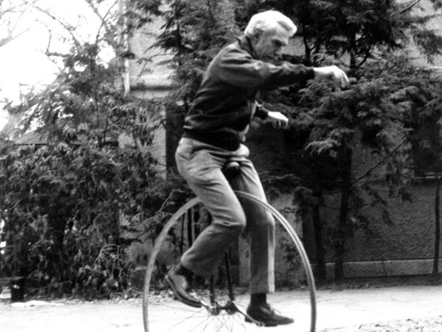

# Let's talk about Data


Last week, we started reading from and writing to a text file. This means that it's time to have a little chat about data.

What is data? There's a lot of definitions, but we'll be sticking with the version that's most common in computing: data is a representation of information through encoding. This definition, which so relies on the word "information", takes us down a real historical rabbit hole. I apologize for setting you all up like this. I'll try to keep it brief.

## Claude Shannon and the Quality of Being Surprised

Information, that which is related to the act of informing, from the latin *information*: *outline, concept, or idea*. The history of knowledge and epistemology and all that thinking about thinking goes back a very long time and I am completely unqualified to teach anyone about any of it. I think David Hume invented it in 1740 or something. For my sake, we'll start in 1948 with Claude Shannon.



Shannon was an American electrical engineer and mathematician known for his foundational work on information theory and digital circuits, and for his enthusiasm for mathematical puzzles, juggling, unicycles, and computer chess. He created a machine (with his student, the AI pioneer Marvin Minsky) whose only function was to turn itself off.

In 1937, at the age of 22, he wrote a master’s thesis that established the fundamental principles of digital circuit design from which all modern computers were created. At 32, he published the landmark paper, *A Mathematical Theory of Communication* which founded the field of information theory. It's this paper that we're interested in.

I think it's actually kind of funny, teaching Shannon and information theory in an introduction digital humanities tech course. There's a good deal of text analysis in DH, but Shannon worked out the fundamental ideas about information from the opposite direction.

After he got his doctorate, Shannon went to work at Bell Labs, where he worked on secure communications during World War II (when Alan Turing, working on breaking codes instead of making them, visited Bell in 1942, the two met for tea daily). One major problem with scrambling messages so that they can't be read is that messages written in human languages tended to be really predictable. At a basic level, there is an enormously uneven distribution of letters in English (as one example). At a higher level, some sequences of letters appear frequently while others never appear in any word and there are many more possible combinations of five letters than there are five-letter words. Predictability opened up weaknesses that codebreakers could exploit. In fact, Turing's work breaking the German Enigma cipher often relied on the frequency of common messages like "nothing to report".

In *A Mathematical Theory of Communication*, Shannon considered the meaning of this sort of uneven distribution. Let's say that we're playing a few rounds of the word game Hangman, but I take pity on how poorly you're doing and tell you one the first letter of a word right off the bat. Do I give away more or less information if I tell you that the word starts with "S" or with "Q"?

Shannon recognized that what the amount of information conveyed could be understood as entropy, essentially the degree to which you are surprised at learning something. If I tell you that the word starts with S, that fact tells you less than if I told you that the word starts with Q because many more words start with S than start with Q. In the same sense, telling you a losing lottery number conveys less information than telling you a winning lottery number. In communication, we often intuitively reduce the length of text by swapping out common letter combinations, phonemes, and phrases with shorter replacements: LMAO, Ph.D., SLab, et al. Mechanically, we can reduce the size of lower entropy files like English text by compressing them. A ZIP file of the Much Ado About Nothing text from last week is about 60% smaller.

Shannon suggested that we could exactly quantify this degree of entropy to measure the information content. Consider a coin that has an equal chance of flipping heads or tails. Flipping that coin selects between two equally possible outcomes, producing an entropy of one "bit", a portmanteau of "Binary Digit".

Hang on to that for a second.

A year after Shannon published *A Mathematical Theory of Communication*, he published an expanded version of the paper. In recognition that the ideas it contained were more universal and more fundamental than he had realized, Shannon titled this new version, *The Mathematical Theory of Communication*.

## Analog and Digital

Up to this point, the examples that we've used have mostly been digital rather than analog. Digital meaning: like the digits on your hand. Data that is discontinuous or "discrete", represented by distinct symbols like letters and numbers. This is opposed to analog, in which data flows in continuous, infinitesimal curves. A digital clock shows the time as distinct instants: a single state for each second or minute. An analog clock shows time as infinitely reducible moments that flow one to the next (well, not really - escapements and quartz oscillations and stepper motor steps complicate this *analogy*). Natural language is digital in the abstract, comprising distinct characters and dictions. Printed on a page or voiced as speech, it takes on analog qualities. DNA is an example of naturally occurring digital data.

It's easier to think of basic Information theory concepts using digital examples, but the field applies to analog data as well and Shannon actually has a lot of say about analog phenomenon like noise. There's also a cosmology called digital physics that describes the entire universe as fundamentally describable by (and, in fact, comprising) discrete information such that analog only exists as imperfect knowledge of reality. Reality is just PDFs all the way down. But ontology is outside of the scope of Code Lab. We're going to focus on digital because, duh, it's not "Analog Humanities."

Around the time that Shannon was thinking up his ideas about information, the earliest digital computers used electrical relays as its basic mechanism. These were actual mechanical switches that opened and closed to complete circuits. Relays were slow and unreliable. Grace Hopper, co-creator of the 1940s-era Harvard Mark II, jokingly coined the word "bug" after finding a moth that had flown into one of the relays and shorted it. 


These relays were replaced in the next generation of computers by faster and more reliable vacuum tubes, which were in turn replaced by faster and more reliable transistors. Virtually all electronics today use microscopically tiny transistors. These different classes of fundamental computer components are, in their most basic form, switches that have two states: on and off. This meshed neatly with Shannon's work on digital circuit design and early computer memory and storage technologies like core memory that stored a single bit to a core. Through these technological contingencies, modern computers almost universally use binary codes at their most basic level, the bit is the most fundamental unit of computer data, and "binary" itself has become slang for compiled computer software.

Computers don't really understand human languages ("natural language" is the term of art). When they filter out the background noise from the recording of a person's speech, it does it by frequency and repetition, not by understanding. In this way, a bit of information entropy is conceptually different from a bit of computer data. When we talk about computer data, we don't think about the informational meaning of the data conveyed, just the space taken up. In some cases like plain text, the difference can be significant (text file versus zip file), but in other cases, the format of the data itself strives to reduce redundancy (such as JPEG or MP3 encoding's designs accounting for the limits of human perception).

## Binary and Friends

### Number systems

In a binary system, data is represented by 1s and 0s, often understood as analogous to on and off, true and false. A single binary value represents a bit, but multiple digits can be strung together like in decimal systems to represent larger values. Counting in binary goes 0, 1, 10, 11, 100, 101, etc. Binary numbering has a possibly long history that goes back maybe thousands of years. Its modern form was developed by 17th century philosophers including our old, weird friend Gottfried Leibniz.

Just as decimal is a base-10 system, binary is base-2. Each decimal numeral adds 10 times as many possible numbers: 1 digit has 10^1 possibilities (0-9), 2 digits has 10^2 (0-99), etc. Each binary numeral adds twice as many possible numbers: 1 digits has 2^1 (0-1), 2 has 2^2=4 (00, 01, 10, and 11), 3 has 2^3, and so on. Binary can be converted back and forth from decimal easily enough: take each digit and add 2^x to it if it is a 1, where x is the position of that digit (starting from zero). 1101 in binary is 2^3+2^2+2^0 = 13 in decimal. If you keep an eye out, you'll see powers of two crop up a lot of places in computing.

There are other number systems. Hexadecimal/hex and octal (base 16 and base 8) are common ways to compress binary into more compact forms. These use decimal numerals. Hexadecimal uses 0 to 9 and then A to F. Since 16 and 8 are themselves powers of two, it's simple to convert between them and decimal. Each octal digit maps directly to a set of 3 (2^3=8) binary digits and each hex digit maps directly to a set of 4 (2^4 = 16) binary digits. So, 32 in octal is 011010 (011 is 3, 010 is 2). A8 in hexadecimal is 10101000 (1010 in binary is A in hexadecimal and 10 in decimal, 1000 is 8).

### Text

These number systems are effectively just different representations of the same numerical ideas. Other forms of data can be encoded using numbers. We've already worked plenty with text. Under the hood, each character is represented on a character encoding table that map numbers to letters. An important and influential encoding scheme is ASCII: the American Standard Code for Information Interchange, formalized in 1968. ASCII maps Latin letters and Arabic numerals, as well as common punctuation symbols, to a set of 128 numbers. 128 is 2^7, so these numbers can be represented by a total of 7 bits. 


Since the 1960s, software developers have created a plethora of character encodings, often to represent characters from other languages. Although you might occasionally run into these in older datasets, the singular modern text standard is called Unicode (well, sort of singular, since it's a family of encodings), which strives express the complete canon of human language. The current specification, Unicode 13, encompasses 143000 characters, including emoji and archaic scripts. The first 128 characters of Unicode are identical to ASCII, which helps maintain backwards compatibility with older Latin text data.

### Colors

Colors are often expressed in computers by a series of numbers representing the mixture of additive or subtractive colors. For digital displays, the RGB system is the most common. This comprises a set of three numbers representing the amount of red, green, and blue light ("channels"). Early color computer displays used a single bit (on/off) to represent each color, but the most common standard is 8 bits per channel (0-255) for a total of 24 bits (or 16 million total color combinations). These are often shown as hexadecimal numbers. Since each hex digit is equivalent to 4 binary digits, each 8-bit color channel can be represented by 2 hex digits. If we look at the [Scholars' Lab website](https://scholarslab.org/) and dig through the stylesheet, we will see that the background color is defined as `000000`, a set of three hexadecimal numbers indicating that each color should be 00 out of FF in hex, which is also 0 out of 255 in decimal. This is the blackest black. Links are underlined with the color `75e3f0`, which is a little red and a lot of green and blue resulting in a cyan color.

### Also: Bytes!
Byte is another common unit of measurement for data. The term is a play on bit and was coined in the 1950s for Project SAGE, a prototype computer system to coordinate American air defenses in the Cold War. There is some historical ambiguity, but a modern byte is 8 bits, representing the smallest power-of-2 size for useful data (such as a single character or a small integer). Bytes and bits are often modified with metric scale prefixes: kilobyte, megabit, etc. This is a total mess because it mixes binary units with decimal prefixes. I don't even want to get into it.

## Data Structures

Okay, this is too much talking. We should do some doing, which means that it's back to Python. Also, here's Hazel again.


We've discussed a few different ways to represent different types of data using the underlying binary computer systems. Going one level above this is the concept of a "data structure", which are ways to not only represent information as data (RGB, Unicode, etc.) but to efficiently access and manipulate them. We've already been working with plenty of built-in data structures in Python.

The most fundamental kinds of these are often called "primitives" in computing. In Python, these include integers (whole numbers), floats (floating point numbers, which represent real numbers--"the ones between integers"), strings (text), and booleans (`True` and `False`). You should have a good sense by now of how each of these are represented (except for floats, which are weird).

More complex (creatively, "non-primitive") structures such as lists (which we've worked with) and dictionaries (which is new this week!). As we have seen, Python lists contain other objects which are instances of data structures. Lists organize data into an ordered and linear collection. Dictionaries are similar in that it contains a collection of other objects, but in this case organizes them into an unordered mapping.

Incidentally, because lists can contain any object, you can do funny things in Python like append a list to itself.

### Dictionaries

A Python Dictionary associates pieces of data to other pieces, much like a physical dictionary or a phone book that maps keys (e.g. a word in a dictionary or a name in a phone book) to values (e.g. the definition in a dictionary or the phone number in a phone book). Technically, it is a collection of one-to-one key-value pairs, in that one key maps to exactly one value, however the values can themselves be any object, including collections of objects like lists or dictionaries.

Yes, you can have a dictionary assign itself as a value.

Meanwhile, keys must be hashable objects, which I'm not going to get into right now. For the most part, it means that keys should be primitive objects.

Dictionaries are defined using curly brackets, but they're addressed like lists. You can even use integers as keys, just like the index to a list. However, there is no provision for index continuity (i.e. list indices don't skip numbers, but dictionary keys can be whatever you want).

```python
d = {} # create an empty dictionary
d[1] = 5 # assign the value 5 to the key 1
d[3] = "b" # assign the value "b" to the key 3
d["a"] = [5] # assign the value [5] to the key "a"
print(d)
```

As we can see, you can mix and match different types of values like for lists. And we can also mix and match different types of keys.

We can also assign starting values when defining a new dictionary by separating keys and values with a colon. This code is equivalent to the above.

```python
d = {1:5, 3:"b","a":[5]} # create a not-empty dictionary
print(d)
```

As with lists, we can traverse dictionaries using for loops:

```python
dogs = {"Shane":"Hazel", "Amanda":"Maple", "Ronda":"Bofur"}
for owner in dogs:
    print(owner+"'s dog is "+dogs[owner])
```

Here, we see that using for loops through all the keys in a dictionary. We can actually get a hold of the list of keys for this dictionary with `dogs.keys()` and a list of the values for this dictionary with `dogs.values()`. Some people prefer this convention that grabs key and value in a for loop:

```python
dogs = {"Shane":"Hazel", "Amanda":"Maple", "Ronda":"Bofur"}
for owner,dog in dogs.items():
    print(owner+"'s dog is "+dog)
```

Dictionaries are unordered, so while this example loops through the order in which I constructed the dictionary, that isn't guaranteed.
