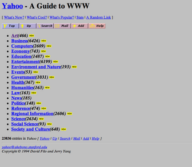

# Application Programming Interfaces

## Interfacing with Applications through Programming

API stands for Application Programming Interface, which is a sort of almost meaninglessly broad set of words. The important part is "interface": APIs are a broad set of concepts that involve defining the boundaries between things.

In a programing sense, an interface for describes what something should do while an implementation describes how that something will do it. This should be familiar already, since it's been a common theme in CodeLab: we can think of a function call as the basic components of an interface and, so long as we know what arguments to pass it, we don't have to know how to actually do it. We'll talk a little more about this in a moment. Often, the documentation for, say, a software library is referred to interchangably with "API" since the interface is most of what users of a library care about.

So, APIs is a pretty big tent of different ideas. They are used for such different things as:
Programming languages (Oracle v. Google)
Libraries
Databases
Hardware and hardware-adjacent things
File systems
Operating systems
Web APIs

As we can see from this list, APIs are often defined in common ways so as to function as formal or de facto standards. But they don't have to be - they can be totally customized to unique purposes.

# Abstraction and Modularity

...

# Class interfaces

...

# Web APIs
The Internet was originally intended to be a collection of static documents with unique addresses, the URL (uniform resource locator). Static content is "baked in" and unchanging, at least in the short term. The same document on a server is the same to one person as it is to another and material that hasn't been explicitly created or material that depends on user input could not be sent (we're going to overlook client-side code for now; dynamic code running in the browser can mimic a lot of what dynamic code running on the server can do). A good example of an early static website was Yahoo.com. Its first versions were static directories of content that the creators curated by hand and organized by heiarchy and was named "Jerry and David's Guide to the World Wide Web". It took a year to add a dynamic search mechanism.

Serving dynamic content over the Internet was a significant challenge. Beyond the teething issues of any new technology (such as a lack of established standards), there were fundamental problems with the distributed nature of the Internet itself. There was no way to ensure that messages between local clients and remote servers were received or else were received in order. Multiple clients trying to read and manipulate the same data easily ran afoul of consistency issues (think of the issues with version control, but multipled by potentially tens or hundreds of thousands of clients). Beyond basic engineering hurdles, there were [theoretical limits to distributed computing](https://en.wikipedia.org/wiki/CAP_theorem) what could never be overcome.

Remote computing was nothing new, of course. Some of the terminology and concepts that we've become familiar with over the course of Code Lab--the terminal, most obviously--suggest past computing paradigms that had similar topologies. However, the more open nature of the Internet and its explosive popularity overwhelmed older solutions. They were simply impracticable to scale.

(Skipping a few steps) Through the 2000s, developers settled on a variety of methods to accomplish a more sustainable dynamic web. One of these was the REST web service/API. REST (for REpresentational State Transfer) is a broad approach (rather than a technical standard) for 

REST - "Representational state transfer" method, not standard
    stateless
    return to the basic representation of the original Internet: resources addressible by identifiers, but with resources that aren't necessarily statically generated or unchanging
    well-formed response

API key, secret, token
API version numbers
API Limits
