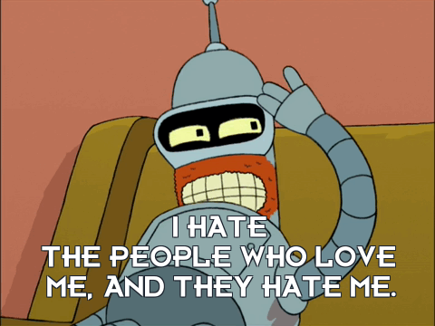

# Week 12: Web Scraping

## Python Libraries, revisited

In the last few weeks, we've been playing around with using Python code that people who are not Python (and who are often not you) wrote. Let's take a closer look at these libraries.

First, let's properly go over some terminology that we might have brushed past:

* Library: There's a lot of different definitions for this term. Unless really unexpected things have happened, we are currently sitting in one right now. But in the CodeLab context, this is a collection of software that's directly used by other software. Most often, this will be a generalizable piece of logic that is useful to bundle separately so that other, unrelated pieces of software can use it. Because it's an informal term in Python and not a specific, technical one, it's more useful to think about libraries in terms of how code is organized. Used in this way, the concept of "software libraries" spans many different programing languages and development contexts: we have Python libraries, C++ libraries, Javascript libraries, operating system libraries, etc.

 Let's consider libraries that we've used. The [Python Standard Library](https://docs.python.org/3/library/) is the most obvious example which encompasses many different purposes and packages (more on that later), but is unified in that it is included in all Python installations so that Python code that's written using the Standard Library will run on any compatible Python environment of the expected version. Parts of the Standard Library that we've used before include packages like [random](https://docs.python.org/3/library/random.html) and ones that we'll be using shortly, like [json](https://docs.python.org/3/library/json.html).

 Third-party libraries found on PyPI are less expansive than the Standard Library. This week, we'll take a look at [Beautiful Soup](https://www.crummy.com/software/BeautifulSoup/), which is analogous in scope to packages like random or json. In fact, third party libraries are often organized into a single package. A library like Beautiful Soup can best be thought of in terms of purpose: you want to accomplish the a particular, common task like scraping a website and Beautiful Soup helps accomplish it. 

* Package: A package is a formal term in the Python context. It's a specific organization of code which all lives in a single directory. Libraries sometimes (often) consist of a single package (e.g. Random or BS4), so the term is sometimes (often) used interchangeably. Packages are the basic unit by which we install and use libraries. PyPI is the Python *Package* Index, so when we type `pipenv install beautifulsoup4` into the terminal, we're installing the beautifulsoup4 package.

 Here, confusingly, the name of the package on PyPI (beautifulsoup4) doesn't match the actual Python code package (bs4). Always [read the docs](https://www.crummy.com/software/BeautifulSoup/bs4/doc/)! 
 
 We use Beautiful Soup in our Python code with code that looks like this:
 
 ```python
 from bs4 import BeautifulSoup
 # 'bs4' is the package, 'BeautifulSoup' is a class defined inside the package definition
 soup = BeautifulSoup(html_doc, 'html.parser')
 ```
 
 Or:

 ```python
 import bs4
 soup = bs4.BeautifulSoup(html_doc, 'html.parser')
 # this code is equivalent
 ```

 We can also use the star symbol, which often means "all" or "any", to import all the modules in the package:

 ```python
 from bs4 import *
 soup = BeautifulSoup(html_doc, 'html.parser')
 # imports * imports all modules in a package
 ```

 In these examples, we can either the `bs4` *package* directly or, using the `from` keyword, import *modules* from with that package.
 
* Modules: Since a Package is a directory, we can probably intuit that Modules are individual Python files contained within a directory. In fact, every .py file can be a module if we import them into another bit of Python code. Often, this is most useful for separating variables from code and for breaking classes out into their own file. So, we can do this (we can tell git to ignore config.py and freely commit code.py):

 config.py:
 ```python
 PASSWORD = "passw0rd"
 ```
 
 code.py:
 ```python
 import config
 if input("Enter password:") != config.PASSWORD:
    print("WRONG PASSWORD")
    exit()
 ```

 And we can do something like this:

 doglib.py:
 ```python
 class Dog:
    def __init__(self, name):
        self.name = name
        print("Bark! My name is "+name)
 ```

 code.py:
 ```python
 import doglib
 # dog is the module, 
 hazel = doglib.Dog("Hazel")
 ```

## XML


(XML [left] and JSON [right])

We've covered some JSON already. Let's talk about its older, more monstery cousin. They're not exactly the same kind of thing. JSON is intended, as we've seen and used, to encapsulate object states. XML stands for "Extensible Markup Language" and the Markup Language part means that it's a way to "mark up" text in ways that convey information beyond the very narrow boundaries of the text, like an editor might mark up a document.

That is, markup languages provide ways to express anything that isn't directly expressible as text characters: *emphasis*, /italics/, (links)[https://github.com/scholarslab/CodeLab/blob/master/Week05/assets/hazel_romantic_hero.jpg], spacing and layout, typeface, and so on. Images too.


When you all blog, you're writing in another markup language, the whimsically-named Markdown.

But despite the differences of intention, both XML and JSON (and also CSV and markdown) are text formats designed to contain and structure data.

Let's take a quick peek at what XML looks like. Let's shift gears from our usual Much Ado About Nothing examples and move on to the 31st century.

```xml
<scene id = "30" type = "INT" location = "PlanetExpress" episode="S01E3">
    <dialog role="Leela">
        Please, Bender! Have some malt liquor! If not for yourself, then for the people who love you.
    </dialog>
    <dialog role="Bender">
        I hate the people who love me and they hate me!
    </dialog>
</scene>
```



This is an arbitrarily constructed example. XML is built around tags that represent discrete elements. In the example above, `scene` and `dialog` are tags. Tags can contain attributes, such as the `role` attribute for `dialog` or the `location` attribute in `scene`. Tags can wrap around text and we can understand that the tag contains the text, like the label for a link or the text of a line of dialog.

XML is really verbose and you have to be really careful about closing tags correctly. But it's quite powerful, with entire secondary languages to define its schema, to translate it from one XML format to another, and to traverse the data that it contains. That complexity makes it a bit clunky to use.

The "Extensible" part of the XML name means that we can use this basic structure to build other languages. Just like my constructed Futurama script example can form a standard format to represent dialog, XML can be extended (really, constrained) to represent the structures of other specific kinds of data. One example is TEI, the Text Encoding Initiative, which uses XML to represent text documents. Another is the modern form of HTML that the web runs on.

You'll cover HTML and its accompanying technologies in much greater depth in the next few weeks. For now, it's enough to know its general shape.

## Web Scraping


Okay, let's put these ideas together. Let's scrape some websites.

Web scraping is extracting data from web pages, using the syntax of a web page. It's great for compiling datasets when you don't already have them in a database somewhere. A good supplemental resource for web scraping is [Intro to Beautiful Soup by Jeri Wieringa](https://programminghistorian.org/en/lessons/intro-to-beautiful-soup) at The Programming Historian.

### So how do we scrape the web?
In Python, there's more than a few different libraries we could use, but let's continue to focus on Beautiful Soup.

We've already installed the library into our pipenv using:

```python
pipenv install beautifulsoup4
``` 

We can make sure this was done correctly by importing the library into a Python file in our virtual environment and printing its version number (remember to activate the appropriate pipenv shell if you haven't yet).

```python
import bs4
print(bs4.__version__)
```

Now let's figure out how to use BeautifulSoup by going to the [documentation for the library](https://www.crummy.com/software/BeautifulSoup/bs4/doc/). Let's take a quick look at that now.

Okay, let's do this. Let's try scraping the [Scholars' Lab blog page](https://scholarslab.lib.virginia.edu/blog/)

First, we should have pipenv install another library to help us grab websites. There are some good built-in ways to download things from the web, but one of the easiest to use and most popular is the third party library Requests (coincidentally by Kenneth Reitz, the same guy who wrote Pipenv).

After we do that, we can download our website using this code:

```python
import requests

url = "https://scholarslab.lib.virginia.edu/blog/"
html  = requests.get(url).text
print(html)
```

Now that we've got the raw HTML of the site, we can then use Beautiful Soup to parse it.

Let's import beautiful soup...

```python
from bs4 import BeautifulSoup
```

Next, we'll instantiate a Beautiful Soup instance and pass it our html. One easy thing we can do is have BS prettify our html so it's a bit more expansive and readable.

```python
from bs4 import BeautifulSoup
import requests

url = "https://scholarslab.lib.virginia.edu/blog/"
html  = requests.get(url).text
soup = BeautifulSoup(html)
print(soup.prettify())
```

We can see here that `soup` is an instance of a [BeautifulSoup class](https://www.crummy.com/software/BeautifulSoup/bs4/doc/#beautifulsoup). This is an object that represents the whole of the document. The other important class we will use is the [Tag class](https://www.crummy.com/software/BeautifulSoup/bs4/doc/#tag), which represents an html tag. These two classes actually share many of the same methods: we can use `get_text()` on either a BeautifulSoup or a Tag to extract just the text that they contain.

We can also use the `find_all()` method that they share to search with either the whole document or within the tag. Remember that tags can be nested within each other.

Let's take a look at the basic structure of the html file. We can do this easily using the development console built into most popular browsers. In Chrome or Firefox, right clicking (or control-clicking) and choosing "Inspect" or "Inspect Element".

We can see that, for example, the authors for each blog post live in something called a `div` tag that looks like this:

```
<div class="blog-meta__author">
    <a href="/people/brandon-walsh/">Brandon Walsh</a>
</div>
```

Let's ignore most of the nitty gritty of what this means right now, but we can see that the outer tag is a `div` tag, which contains an `a` tag within. These are some of the basic building blocks of HTML: `div` tags are "divisions", containers that are used to organize text and other tags together. `a` tags are anchors, which are used for links. So this html block is a container (`<div class="blog-meta__author">`) that contains a link (`<a href="/people/brandon-walsh/">`) that points to the author of a blog post.

We can see that the outer div tag has an attribute, `class="blog-meta__author"`, which we can pass to BeautifulSoup to find all the author divs. To do this, we tell `soup` to `find_all` the `div` tags that are of class `"blog-meta__author"`:

```python
...
print(soup.find_all("div",class_="blog-meta__author"))
```

This bit of code results in a Python list containing 4 Tag objects representing the authors of the 4 most recent blog posts. We can drill down into each of these Tags to get at their contents. For example, we can get the name for each author by getting the text of the `a` tags. The `find()` method is like `find_all()`, but just returns the first result (so it's equivalent to `find_all()[0]`).

```python
...
author_divs = soup.find_all("div",class_="blog-meta__author")
for author_div in author_divs:
    print(author_div.find("a").get_text())
```

To get the URL for each author, we can ask soup for the "href" attribute for the `a` tag by passing it the name of the attribute like the key of a dictionary.

```python
...
author_divs = soup.find_all("div",class_="blog-meta__author")
for author_div in author_divs:
    print(author_div.find("a")["href"])
```

Knowing how to grab links means that we can follow them by asking Requests to grab the website at that URL. This way, we can write a "spider" to crawl through entire websites. This is a very powerful way to map out online datasets that aren't designed to be very accessible.

Don't worry if the details of the HTML are a bit arcane. We'll cover these in much greater detail over the course of the next few weeks.
