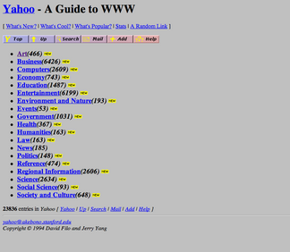

# Application Programming Interfaces


## Interfacing with Applications through Programming

API stands for Application Programming Interface, which is a sort of almost meaninglessly broad set of words. The important part is "interface": APIs are a broad set of concepts that involve defining the boundaries between things.

In a programing sense, an interface for describes what something should do while an implementation describes how that something will do it. This should be familiar already, since it's been a common theme in CodeLab: we can think of a function call as the basic components of an interface and, so long as we know what arguments to pass it, we don't have to know how to actually do it. We'll talk a little more about this in a moment. Often, the documentation for, say, a software library is referred to interchangably with "API" since the interface is most of what users of a library care about.

So, APIs is a pretty big tent of different ideas. They are used for such different things as:
Programming languages ([Oracle v. Google](https://en.wikipedia.org/wiki/Google_LLC_v._Oracle_America,_Inc.))
Libraries
Databases
Hardware and hardware-adjacent things
File systems
Operating systems
Web APIs

As we can see from this list, APIs are often defined in common ways so as to function as formal or de facto standards. But they don't have to be - they can be totally customized to unique purposes. They're also useful for hiding away the complex inner-workings of code from users who don't need to know about them by exposing a "public" interface that almost all users will use exclusively.

So, "API" is a big, generic term. What we're interested in today is the important subset of Web APIs, designed to be accessed through the Web.

# Web APIs
The Internet was originally intended to be a collection of static documents with unique addresses, the URL (uniform resource locator). Static content is "baked in" and unchanging, at least in the short term. The same document on a server is the same to one person as it is to another and material that hasn't been explicitly created or material that depends on user input could not be sent (we're going to overlook client-side code for now; dynamic code running in the browser can mimic a lot of what dynamic code running on the server can do). A good example of an early static website was Yahoo.com. Its first versions were largely static directories of content that the creators organized and curated by hand and was originally named "Jerry and David's Guide to the World Wide Web". It took a year to add a search mechanism and that was too demanding to use during daytime, when more people had access to the Internet through work.

[Take a look](https://www.webdesignmuseum.org/gallery/yahoo-1994).



Serving dynamic content over the Internet was a significant challenge. Beyond the teething issues of any new technology (such as a lack of established standards), there were fundamental problems with the distributed nature of the Internet itself. There was no way to ensure that messages between local clients and remote servers were received or else were received in order. Multiple clients trying to read and manipulate the same data easily ran afoul of consistency issues (think of the issues with version control, but multipled by potentially tens or hundreds of thousands of clients). Beyond basic engineering hurdles, there were [theoretical limits to distributed computing](https://en.wikipedia.org/wiki/CAP_theorem) what could never be overcome.

Remote computing was nothing new, of course. Some of the terminology and concepts that we've become familiar with over the course of Code Lab--the terminal, most obviously--suggest past computing paradigms that had similar topologies. However, the more open nature of the Internet and its explosive popularity overwhelmed older solutions. They were simply impracticable to scale. Through the 1990s, as the Web exploded, the problem of dynamic websites and Web services yielded a variety of incompatible solutions that provided some relief, but also increased the complexity and fragility of the Web. These designs exacerbated the very sort of problems that we promote minimal, static sites to avoid.

Into the 2000s, developers adopted a variety of methods to make dynamic websites more sustainable, resiliant, and secure. Ultimately, the most dominant of these was REST. REST (for REpresentational State Transfer) (adjective: RESTful) can be thought of as an architectural style for the design of Internet resources, rather than a specific technical standard. Echoing Claude Shannon's groundbreaking master's thesis that fundamentally theorized digital computing, REST was proposed through computer scientist Roy Fielding's doctoral dissertation.

REST specifies many things; for our purposes, the most important way that it simplified the Web was its enforcement of statelessness, meaning that:

> [...] each request from client to server must contain all of the information necessary to understand the request, and cannot take advantage of any stored context on the server. Session state is therefore kept entirely on the client. ([Fielding](https://ics.uci.edu/~fielding/pubs/dissertation/rest_arch_style.htm#sec_5_1_3))

This allowed Web services to scale more easily and for clients to recover from communications errors and uncertainty. A good common counterexample of unRESTful design are the dreaded "ONLY CLICK THIS BUTTON ONCE" or "DO NOT PRESS BACK ON YOUR BROWSER" admonitions of (often, but not always) older sites. Statelessness also implied another attribute of REST: uniform, unchanging identifiers. Since state is stored in the client, it was important that remote resources could be addressed in a consistant way, much like how well-designed websites have permalinks.

While REST has been very influential, it also ran directly counter to some of the other prevailing treads of the 2000s Internet: social media and targetted advertising (may be thought of as the same trend). It suddenly became big money to capture not just the information about the specific purpose of a web service but everything about users and to bridge different digital identities across Web services. So while some aspects of REST were widely adopted by larger websites, others were not.

But the reason why we're talking about REST today is that it is more popular for APIs than for websites, especially for services that functionally resemble the sort of thing that the Web and HTTP were originally designed for.

Here is a [list of free, public Web APIs](https://github.com/public-apis/public-apis) to give you a sense of what's out there.

There are APIs for everything from the [Library of Congress](https://www.loc.gov/apis/) to [Libretranslate](https://libretranslate.com/docs/) (natural language translation) to the sadly defunct Owen Wilson Wow: the API for actor Owen Wilson's "wow" exclamations in movies. Years ago, before I got sweet Rocky, I used the [Petfinder API](https://www.petfinder.com/developers/) to regularly download hundreds of photos of nearby adoptable dogs and then had my screensaver show them.


All the APIs on that list are supposed to be both public and free, and we can see three useful columns in addition to the name and description: Auth, HTTPS, and CORS. Some APIs have gated access, either to restrict access to only authorized users or, more relevant to this list, to enforce rate limits (how often requests are made). Some are not gated at all and do not require user authentication (though they may still enforce rate limits in a less granular fashion through IP). Authentication can be performed through either API keys (a sort of long password generated by the service used just for access to that specific API) or OAuth (authentication through a third-party, like "log in with Facebook"). HTTPS means that the service supports encrypted requests and responses. This should be almost universal by now and the lack of support implies that the API is poorly supported and not up to date. CORS is for embedding API access into other sites, through javascript. That's very powerful, but we won't be doing any of that today. API authentication is fairly easy, at least the ones that support API keys, but for the ease of those following along at home, we'll pick an example without any authentication at all.

Let's try out [IMDbOT, the Free Movie Series DB API](https://github.com/TelegramPlayground/Free-Movie-Series-DB-API). This is a good example because it is extremely simple and the documentation very helpfully provides us code directly.

On the API documentation page, if we go to the [Search Movies on IMDb](https://imdb.iamidiotareyoutoo.com/docs/index.html#tag/default/GET/search) section, we can see that the kind of parameters it accepts are quite limited: `q` for keyword search query and `tt` to fetch the details for a specific IMDb ID. Let's try it out by hitting "Test Request".

Here, we can just fill in the `q` parameter field and hit the "Send" button up top and we get a familiar sight: our good friend JSON!


It also shows us the URL of this particular action, what we call an API endpoint: `https://imdb.iamidiotareyoutoo.com/search`. If we were to manually add in the query parameter by appending `?q=cuba` to the end of that, we get the full API request url: [https://imdb.iamidiotareyoutoo.com/search?q=cuba](https://imdb.iamidiotareyoutoo.com/search?q=cuba), which we can actually open up directly in a web browser. This is the sort of magical simplicity of REST APIs, especially those that don't bother with authentication.

Let's bring this into Python. There's a dropdown with the default value "shell curl" (cURL, "client for URL", is a common shell command for transferring data across networks) and we can choose one of the Python options there instead. We can use the Requests package from last week, but this API is simple enough that we can also just use the built-in Python http module instead:

 ```python
import http.client

conn = http.client.HTTPSConnection("imdb.iamidiotareyoutoo.com")

conn.request("GET", "/search")

res = conn.getresponse()
data = res.read()

print(data.decode("utf-8"))
```

Here, we can see that it's making a secure connection to the server (`imdb.iamidiotareyoutoo.com`) and then making an HTTP GET request for the `/search` URL. If we run this, it'll complain that we're missing either the `q` query parameter or the `tt` IMDb ID parameter. So let's just add that to the request URL and maybe load it into the `json` module and dump it to a string in order to pretty up the output.

 ```python
import http.client
import json

conn = http.client.HTTPSConnection("imdb.iamidiotareyoutoo.com")

conn.request("GET", "/search?q=vampire")

res = conn.getresponse()
data = res.read()

response = json.loads(data.decode("utf-8")))
print(json.dumps(response,indent=4))
```

As with web scraping, we can use our impressive Python coding skills to automate additional tasks for each result. We could maybe code up a program to figure out a particular actor's Degrees of Kevin Bacon, although that might be very expensive or even impossible using this API (it looks like they only return a maximum number of results per query). Or we can download each movie poster from our search results (file downloads can be tricky to do with the basic Python httpd.client module, so let's just use Requests again). The stateless nature the API call and the file download means that using two different means to make the API call and download the file is just fine.

```python
import http.client
import json
import requests
import time

conn = http.client.HTTPSConnection("imdb.iamidiotareyoutoo.com")

conn.request("GET", "/search?q=vampire")

res = conn.getresponse()
data = res.read()

response = json.loads(data.decode("utf-8"))
for i in response["description"]:
    poster_url = i["#IMG_POSTER"]
    print("Downloading... ",poster_url)
    r = requests.get(poster_url, allow_redirects=True)
    open(i["#IMDB_ID"]+'.jpg', 'wb').write(r.content)
    time.sleep(0.5)
```

Just to play it safe, since file downloads can suck up a lot of bandwidth, I added a `time.sleep(0.5)` to wait half a second before loading each image.

IMDbot is a nice toy example for teaching purposes. For more serious use, you might want to use something like [Open Movie Database](https://www.omdbapi.com/), which is also free but requires a user account to generate an API key. Since that's also a REST API, we can just pass the key in as a parameter, like so: 

```python
import requests
import json

API_KEY =  'KEY'

p = {'apikey': API_KEY, 's': 'Top Gun'}
r = requests.get('http://www.omdbapi.com/',params=p)
if r.status_code != 200:
    print("Bad response code!")
    exit()
for movie in json.loads(r.text)["Search"]:
    print(movie["Title"]+" ("+movie["Year"]+")")
    p_movie = {'apikey': API_KEY, 'i': movie["imdbID"]}
    r_movie = requests.get('http://www.omdbapi.com/',params=p_movie)
    print("\t"+json.loads(r_movie.text)["Plot"])
```

But you need actually need your own account's API key for this! It won't work without it.