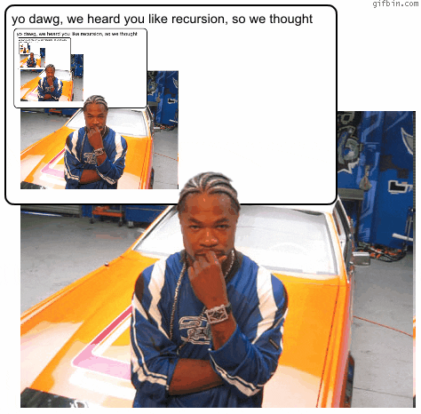

## More program flow

#### Redirecting flow

Sometimes, it can be hard to construct a `while` loop conditional ahead of time. Sometimes, the flow isn't dependent on sequences. Let's say we want to play the children's game Duck Duck Goose. Every cycle, we ask the user to type in "Duck" or "Goose". If the input is "Duck", we continue the loop from the top. If it's "Goose", we break out of it.

```python
while 1:
    word = input("What do you say? ")
    if word.upper() == "DUCK":
        continue
    elif word.upper() == "GOOSE":
        break
    print("Maybe I should explain the rules again...")
```

At the top, `while 1` tells Python to loop forever because 1 evaluates as `True` and so it's just equivalent to `while True`. We can do this a lot of other ways because many things evaluate to `True`: `while "Hazel"`, etc. But `while 1` or `while True` are common and traditional.

If the input word is "Duck", the `continue` tells Python to continue looping, back from the top, *without* going through the rest of the code. If we `continue`, we never reach the `print()` on line 7.

If the input word is "Goose", we hit the `break` and Python breaks out of the entire loop. If we have an infinite loop like `while 1`, we probably want to hit a `break` at some point.

`continue` and `break` can be used in any `for` or `while` loop. But be careful about overusing them, because they can make code hard to read.


### Nested Loops: Loops, But More.



If we want to really master loops, we have to learn how to nest them. Nesting means that we can have one loop inside of another. One reason we might want to do this is if we need to compare different elements in a list with each other.

How might we write a function to check whether a list contains duplicate numbers? With a single layer of looping, it's not so easy. But with two, it's simple. Well. Simple once you get the hang of it.

One good strategy for solving problems like this is to ask: how would we do this as a person? What discrete steps can we break this into? 

So, as a person, how would we check this list for duplicates? `[3,5,7,9,5]`

To start, we need to look at each number in the list individually, to have something to compare all the other numbers to. Let's start with the first number there: 3.

What next? We're at that first number. We should see if there are any other 3s in the list. There aren't.

So we move on to the next number, 5, and repeat. There is another 5, so we can say: "yes, there is a duplicate."

Good, now how do we abstract this in code? Our basic strategy involves two levels of looping: in the first level, we want to take a look at each number; in the other, we want to compare that number against all the other numbers. In Python, this is easier to construct using a `while` loop (`for` loops abstract away some of the index data we want to use).

This is a simple case where we're doing basically the same thing on both levels: just iterating through some numbers. This kind of loop should look familiar:

```python
i = 0 # we're going to use i as a counter to keep track of the index
while i < len(numbers):
    #do some stuff
    i+=1 #increment the index counter
```

So, if we stack one inside of the other, we get something like this:

```python
def got_dupes(numbers):
    i = 0 # i is the first counter, for the outer loop
    while i < len(numbers)-1: #we don't need to loop at the very last number on the outside loop because there's nothing to compare it to
        j = 0 # j is the second counter, for the inner loop
        while j < len(numbers):
            if numbers[i] == numbers[j]:
                return True #duplicate found! Returning True.
            j+=1
        i+=1
    return False #if we complete all the looping without returning, there must not have been any duplicates
```

What's wrong with this code?

We want to loop through all the numbers on the outer loop, but do we want to loop through them all on the inner one too?

Here's the correct code:

```python
def got_dupes(numbers):
    i = 0
    while i < len(numbers)-1: 
        j = i+1 # j starts at the next number after i on every loop
        while j < len(numbers):
            if numbers[i] == numbers[j]:
                return True
            j+=1
        i+=1
    return False
```