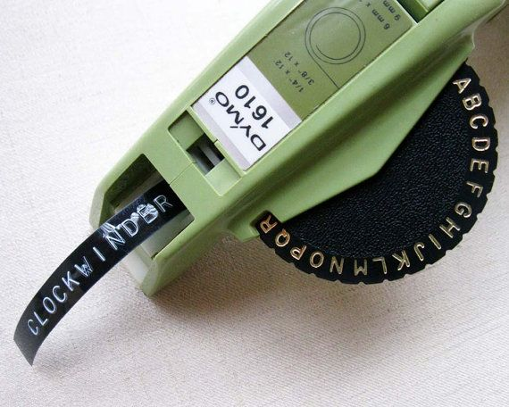

[[Back to chapter index ]](../)


## Before we get started...
Computer programs are algorithms. These two things are so connected in the lay imagination that they are sometimes used as synonyms for each other. The media talks about "The Algorithm" when it describes Google's search and ad services, Netflix's recommendations, or TikTok's infinite video scroll, but an algorithm isn't some sort of magic tech thing. It's just a sequence of unambiguous procedures, like a particularly rigorous recipe. A computer program is an algorithm that's formatted in a language that a computer can understand.

But knowing the language is only part of writing code. We have to know *what* to tell a computer as well as *how*.

One of the best ways to figure out the *what* is to think about how we might solve the same problem as humans. It's useful to break up things we intuitively conglomerate in our heads into discrete steps. We don't usually examine what we're actually doing when we make exact change or sort of deck of playing cards, so it's useful to make the effort to describe each step, algorithmically. After that, it's just a matter of translating our algorithm into computer language.

This kind of process often helps us define the problem more concretely (what do we actually mean when we say "sort a deck of cards?"), identify ambiguity in our procedure ("where does the 'How to Play Poker' card go?"), and discover unexpected "edge cases" that fall outside of our normal use ("what should we do if we encounter an Uno card in our deck?").

## Python interpreter as calculator
Let's get started with Python.

Python comes with an interactive interpreter that executes your instructions as you enter them line by line. For beginners, it's an excellent way to sandbox smaller ideas or check your syntax. In a programming context, an interpreter is a program that translates a human-readable and -writable language like Python into the underlying "machine code" that your computer can understand.

You can start the interactive interpreter using the `python` (or `python3`) command.

_Important note: Once we hit enter, we've gone into the interactive interpreter. Even though we're still in the terminal and we enter commands and recieve response, those commands are Python code and not our familiar shell commands like `ls` or `cd`. It's a totally different mode of using the terminal and it's important to keep track of which mode we're in._

You can exit the interactive interpreter and get back to your shell using the built-in function `exit()`.

One of the simplest things we can do in Python is basic arithmetic. Try it out now in the interactive interpreter. Just type in something like "5*11" and hit enter.

The interactive interpreter is useful to test out an idea or to double check syntax or whether the output of a function matches expectation. It helpfully prints out a lot more data automatically so you don't have to keep asking. It's like a sandbox or a scratch pad - informal and ephemeral, but useful for experimentation.

But what we type into the interactive interpreter isn't saved and we have to feed it line by line, so it's not a good way to actually write a computer program. For that, we can use VS Code to write out code and save it to a file.

In CodeLab, we'll be showing different kinds of code and command line examples and it can be difficult to understand what the context is. When I'm showing a example of the command line interface, each user-input shell command will be prefixed with the "%" symbol, which is a common indicator for the command prompt. For example:

```
% whoami
shane
```

For examples showing the Python interactive interpreter, we'll be using ">>>" to indicate user input lines. The output from Python will lack those symbols. 

```
>>> 1+1
2
>>> 2**3
8
```

Python code outside of the interactive interpreter (such as inside of a .py file) will lack these markers and use Github's syntax highlighting, so the text will be different colors.

```python
1+1
2**3
```

## Saving and running Python files

To write and save a Python program, the typical convention is to use the `.py` extension. When we save a file as a .py file in VS Code, it also tells VS Code that it contains Python code and will automatically activate code highlighting and syntax checking.

To run a Python program that you've saved, we can use the `python` command through the terminal with the name of the file that contains your program (depending on how your computer is set up and what environment context you're in, sometimes this will have to be `python3`).

To run a python code file named "code.py", just run:

```
% python code.py
```

## A quick note about Python 2 and Python 3
The Python programming language began development in the very late 1980s, but became popular after the release of Python 2.0 in 2000 (not to be confused with [Pythons 2](https://www.imdb.com/title/tt0330795/?ref_=nv_sr_3)) when the language switched to a more public code repository and a more open, community-driven development model.

Python 3 is the current major version. It was released in 2008 as a major reformation of the language that made it more consistent and unified redundant mechanisms. Python 3 is not backwards compatible with Python 2; it is, in effect, a new language. It's less and less common now, but if you look up old code examples, sometimes they'll be in Python 2. If you know Python 3, version 2 will easily be intelligible but you'll probably run into problems if you try to run version 2 code in a version 3 interpreter.

Many computers come with Python already installed by default. Depending on how yours is set up, running `python` may run the Python 2 or Python 3 interpreter. To determine which one, run the command `python --version`. Pipenv should have this all sorted out, but more on this later.

## Hello World

Let's take a look at the traditional program used as an introduction for countless millions of programming students before you: Hello World:

```python
print("Hello World!")
```

Try saving this code as a program and running it.

"Print" is a function, which is like a command. Functions are the verbs of programming languages and are executed (we say "called") by writing the function name followed by parentheses. Inside the parentheses are zero or more parameters, which are extra bits of information that you attached (we say "passed") to the function. Here, the "print" function simply writes out the data that we've passed to it: "Hello World!".

## Variables



One of the most fundamental concepts of coding is memory and how to keep track of it.

Let's revisit our old example of code as a recipe. If we're preparing a salad, we might need to make a dressing. Let's use this [one from Kenji López-Alt](https://www.seriouseats.com/simple-vinaigrette-recipe).

We might start by measuring out each ingredient and putting them into containers. To better keep track of things that might look similar, we write a label on each container: "shallot", "garlic", "mustard", and so on.

We also might have a bowl to mix everything up in, which we'll label "dressing." We can add ingredients to the bowl in a particular order and perform actions on its contents like whisking, but the label on each of the containers remains the same and lets us keep track of what's what. Maybe this is too fussy for salad dressing, but useful if we're preparing it as part of a large and complex meal.

In programming, when we work with data, whether it's a novel or a single number, we organize it in a similar way. The containers are called "variables" (because what goes into them vary) and the labels are "variable names." When we put out a container on our counter and label it, we say that we're "declaring a variable." When we put something into a container, that's called "variable assignment."

Every time we need to "remember" something, whenever we describe in our algorithm exercises writing the results of a math function down, tallying a count, or even pointing with our finger to a particular item in a list, we're declaring a variable.

This python solves a little arithmetic:

```python
print(3+4)
```

This does the same thing with variable assignment:

```python
a = 3
b = 4
print(a+b)
```

Note the direction of assignment here. In this example, the variable names "a" and "b" are assigned integers 3 and 4 (an integer is a whole number and also a type of data which represent whole numbers).

Variable names have to start with a letter or an underscore and can only contain letters, numbers, and the underscore character. No spaces. They're also case-sensitive, so `SLAB` `slab` and `SLab` are different. Certain words are reserved by the language and cannot be used as variables. There are some more conventions about what kinds of names should be used for variables, but they'll only be useful once we understand a bit more about how they work.

Variables are useful for a lot of reasons. Not only do they let us save bits of data for later use, they let us change data rather than change code.

Going back to our recipe example, if we're out of dijon mustard but have yellow, we can just put an appropriate amount of yellow mustard into the container marked "mustard." In a more abstract example, if we wanted to be able to quickly calculate how much of each ingredient we need for different servings, we can declare a "servings" variable and multiple each ingredient amount by that variable.


## Classes, Objects, and Instances

If variables are labels, then what is it that they reference? Let's use, in Scholars' Lab custom, a dog metaphor. When we see the word "dog", we understand that word on a variety of levels.

1. In a very high level sense, there's the abstract notion of "dog", which describes the behaviors and qualities shared by all dogs (e.g. "mammal", "endothermic metabolism"). "There is a whole chapter about dogs in this biology textbook."
2. Then there's the actual, physical population of all dogs or some subset of that population. "Dogs are the most popular pet in the world" or "let's go adopt some dogs from the shelter."
3. Finally, there's the specific, singular individual dog that we can both name and point to. "Rocky is a surpassingly fine dog."

In a programming language, these catagories are useful to illustrate the relationship of classes, objects, and instances

1. The abstract idea of a thing can be described as a "type."
2. The concrete idea of a thing is described as an "class".
3. The name of the exact individual dog is a variable which represents a specific, physical "object" of the dog class. 

This will be clearer once we start to put these terms into practice. Let's take a look back at the last bit of code.

```python
a = 3
b = 4
print(a+b)
```

Knowing that 3 and 4 are integers, we can now say that, in the first two lines, we are assigning instances of the Integer class to two variables, A and B. `Print` is a function that expects an object as a parameter (`print()` is pretty voracious, so many different classes are acceptable as parameters) and the integer that results from `a+b` is an object.

Another thing to note here is that although we print `a+b`, we haven't bothered to assign it to a variable. It's an instance that's just floating out there, without a label. This means that we can't refer back to it later to use it for something else. We'll have to perform the addition function again rather than just being able to remember what it was.

How do we "save" the result of `a+b` by assigning it to a new variable (let's call it `c`)?

### Numbers

So far, using variables in code looks very much like using them in a math equation. Here, we assign names to represent particular pieces of data, often inputs and outputs, and then we use them just like we would in a formula like the pythagorian theorem `a^2 + b^2 = c^2` to find the hypotenuse of a right triangle. In Python, we need to do a little bit of housekeeping to solve for square roots (we'll talk about the `import` line and the bit about `math.sqrt` later). 

For now, we can see how the variables `a`, `b`, and `c` work. Also note that, in Python, `a**2` means to raise `a` to the second power.

```python
import math
a = 3
b = 4
c = math.sqrt(a**2 + b**2)
print(c)
```

`3` and `4` are integers. But this code prints out `5.0` instead of just `5`. This is because the square root function results in a "floating point number" (sometimes just "float") instead of an integer. This is a kind of data that's used to represent real numbers like 1.4142 or 3.14159. In Python, they have limited precision and have some additional quirks due to their underlying binary representation. For our purposes, this is more of an occasional curiosity rather than a serious problem. If you're coding, say, [post office accounting software](https://en.wikipedia.org/wiki/British_Post_Office_scandal), you should probably read up on them more closely.

### Aside: sometimes floats are weird

Let's see what happens when we try to do some symbol floating point arithmetic.

```
>>> 0.1+0.2
0.30000000000000004
```

Weird, right?


(No one really understands binary because no one thinks in binary)

Let's remember that all data in a computer is represented as binary (base 2) numbers, comprising only 1s and 0s. The text you're reading now is represented by individual characters that, under the hood, are stored as binary numbers. The method of translating these information between different forms and contexts (such as between binary numbers and text or numbers) is called encoding.

Integers are easy enough to represent in binary: 0 is 0, 1 is 1, 2 is 10, 3 is 11, 4 is 100, and so on.

But floats are trickier and require a special system to represent. Don't worry about it for now, but consider for a moment that it's impossible to represent exactly 1/3 in finite decimal notation (0.3333...). It's similarly impossible to represent some simple decimal numbers in a binary notation. Which is why you get the weird results above.

[Float to Binary Converter](https://www.h-schmidt.net/FloatConverter/IEEE754.html)

[IEEE 754 Standard](https://en.wikipedia.org/wiki/IEEE_754-1985) if you really want to learn more. You probably do not want to read this.

### Strings

!["I, for one, welcome our new [string] overlords"](assets/overlords.jpg)

Variables can represent different types of data. So far, we've used them for different kinds of numbers, but of course there's also text. In code, we call a sequence of characters "strings," which may be a nod to old typesetting lingo.

```python
noun="Scholars' Lab"
print("I, for one, 'welcome' our new "+noun+" overlords!")
```

(This is a [reference to the classic Simpsons episode "Deep Space Homer"](https://www.youtube.com/watch?v=8lcUHQYhPTE))

On the second line, we use the + operator to concatenate (add together) three strings together and pass the result to print.

This combining of text and string variables is very common. As an aside, there's a special convention called "f-strings" (formatted strings) that makes doing this cleaner (note the `f` before the opening quotation mark).

```python
noun="Scholars' Lab"
print(f"I, for one, 'welcome' our new {noun} overlords!")
```

Use whichever convention is easier for you.

In addition to `+` for concatenation, you can also "multiply" (repeat) strings using `*`:

```python
print("Scholars' L"+"a"*10+"b")
```

### Booleans
```python
print(True)
print(False)
print(True or False)
print(True and False)
print(not True)
```
True in Python is interchangeable with the number 1 and False with 0.

## Comments and Documentation
### Inline Commenting
```python
# Help I'm stuck in a Python interpreter
1+2+3
```

Comments are especially useful--necessary!--for collaboration. Python is open source and its community of millions of coders often share in its permissive approach to intellectual property. Python as a whole is a giant collaborative project of which you are now members.

When you write particularly complicated logic or whenever you write new classes or functions (more on this later!), you should write a comment to explain yourself. I will be using comments extensively in the lesson documents to explain what's going on in code.

### Documentation

Python, as with virtually all other languages and complex codes, contains extensive documentation that covers all aspects of its use. This documentation is [easily accessible via the Internet](assets/MissionImpossible.m4v?raw=true).

[Python 3 Documentation](https://docs.python.org/3/)

Let's take a look at the specific documentation for strings:

[Python 3 Docs: Built-in Types: Strings](https://docs.python.org/3/library/stdtypes.html#string-methods)

Learning to read documentation is a critical skill for succeeding as a programmer. Happily, most of you, as graduate students, should already be literate.

## Input
Code that always does the same thing is a little boring. Let's spice up the earlier example a bit with user input.

We can pull up the [Python documentation for the `input()` function](https://docs.python.org/3/library/functions.html#input).

Here's some example code:

```python
madlibs=input("What manner of overlords do you, for one, welcome? ")
print("I, for one, welcome our new "+madlibs+" overlords!")
```

We can see here that `input` is a function, just like `print`. `input` asks the user to type something and then it "returns" that something back to Python. We'll be writing our own functions soon enough. For now, it's important mainly to understand that functions can hand back bits of data and, like mathematical functions, we can treat the function and the result interchangably in our code. So, if we were to run the example above and the user types in "Rocky", the string "Rocky" would be saved into the variable `madlibs` just as if we'd coded `madlibs="Hazel"`.


## Imports

Earlier, we ran into the line of code `import math`, which let us bring in some code to handle square root calculations. We'll talk about this much more in later chapters, but for now, we can take this opening to sketch out the broad contours of the Python map.

In this chapter, we've mostly been using built-in functions and types, which is the parts of the Python language that's considered so fundamental that it's available to every Python program without the need for additional effort. These are things like `print()` or integers.

The next level up is the Python Standard Library. You don't always want to write your own code. Sometimes things are too difficult and sometimes you just want a standard way of doing things. And programmers are famously ~~lazy~~ efficient. Python has an admirably robust built-in Standard Library of code so you can reuse the work of the thousands of programmers who have contributed to it. This Standard Library is part of the language itself and is included in every Python installation.

Unlike built-in types and functions, you need to import parts of the Python Standard Library into your code using the `import()` function before you can use them. So, we `import math` to bring in the `math` module or `import random` to bring in the module to handle random generation. Then, we can use the parts of those modules.

```python
import random
print(random.randint(0,10))
```

(also see: [Python 3 Docs: Standard Library: Numeric and Mathematical: Random](https://docs.python.org/3/library/random.html#module-random))

The final level of this is that we can download libraries written by other people, which don't come with Python, sometimes called "dependencies." These are typically of more esoteric use or else improve on what's in the Python Standard Library. We'll go into much more detail on how to download and manage those in the future.

The analogy gets a bit clumsily, but we can think of built-in types as ingredients that you always have on hand, the Standard library as those that you bring in situationally from the pantry or refrigerator, and dependencies as items that you need to go to a specialty grocer for.


## The Zen of Python

Finally, type this into Python:

```python
import this
```

Here's [one interpretation of Z of P](https://inventwithpython.com/blog/2018/08/17/the-zen-of-python-explained/).

All this is to introduce the idea that programing languages are not artifacts severed from intention. Their designs are informed in substantive ways by pedagogical and cybernetic theory. And the consequences of those design choices will in turn affect who will use them and not just how they will be used. 

Some of the ideas in Z of P are a large part of why Python has become so popular, and particularly in the digital humanities and data science worlds.